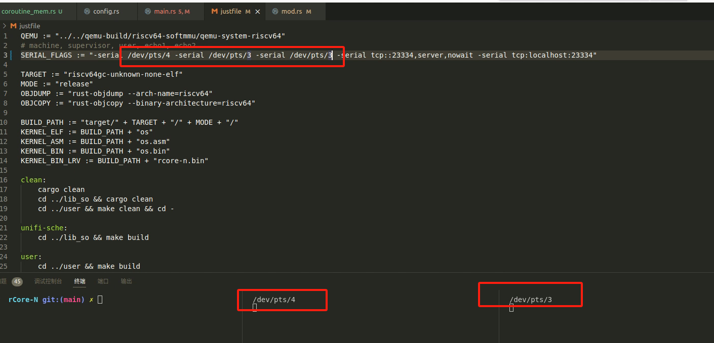

# rCore-N (共享调度器 fork) 搭建和踩坑

> 注意，这是运行 <https://github.com/CtrlZ233/rCore-N> （开源操作系统训练营项目 6，共享调度器 rCore-N）的教程，而不是
> [rv-n-ext-impl](https://github.com/Gallium70/rv-n-ext-impl) 内的 rCore-N
> <https://github.com/duskmoon314/rCore-N> 的教程。
>
> 关于这两者，共有的教程在 [rv-n-ext-impl 文档：使用教程](https://gallium70.github.io/rv-n-ext-impl/ch6_0_user_guide.html) 一章。
> 这里的一些流程与那一章重合，但我这里会把流程补充完整并梳理清楚。

## 流程介绍

1. risc-v 的用户态中断拓展草案非废除，相应的一些工具尚不支持或者该功能被移除（缺乏用户态中断相关的寄存器、指令、LPIC）
  * qemu 未实现用户态中断，所以需要一个添加了该功能的 fork （基于 qemu5）
  * LLVM IR 移除了用户态中断实现，而 Rust 的 `asm!` 其实是对 LLVM IR 的内联汇编语法的简单包装，所以需要固定 Rust 工具链到历史版本号
2. 由于原 rCore-N 声明只维护 justfile 脚本，所以使用 `just run` 而不是 `make run` 来运行 os
  * 注意：需要修改 `SERIAL_FLAGS` 中的三个 pts 设备号，它们应指向当前运行的虚拟终端设备号
  * justfile 是 [just](https://github.com/casey/just) 程序识别的脚本文件，你需要安装 just 程序


### 1. 安装具有用户态中断的 qemu

```shell
# 创建一个文件夹 async-os
mkdir async-os
cd async-os

git clone https://github.com/duskmoon314/qemu.git --depth 1
mkdir qemu-build
cd qemu-build
../qemu/configure --target-list="riscv64-softmmu" --extra-cflags=-Wno-error
make -j
```

注意这里添加的 `--extra-cflags=-Wno-error` 传递给 gcc 的编译器参数，如果没有它，编译 qemu 出现警告会无法继续下去。

### 2. 下载 rCore-N 代码并指定 Rust 工具链

```shell
# 在 async-os 下，如果你从上一步来，那么先 cd ..
# 当前测试的提交号为 41796b8

git clone https://github.com/CtrlZ233/rCore-N.git --depth 1
cd rCore-N
# 创建并编辑 rust-toolchain.toml 文件
vim rust-toolchain.toml
```

```toml
# rust-toolchain.toml 内添加以下内容
[toolchain]
profile = "minimal"
channel = "nightly-2023-01-03"
components = ["rust-src", "llvm-tools-preview", "rustfmt", "clippy"]
targets = ["riscv64gc-unknown-none-elf"]
```

这个工具链文件是由 [rustup](https://rust-lang.github.io/rustup/overrides.html) 识别的，它表示使用文件内的工具链，而不是本地工具链。

对这个文件内容一些解释
* minimal profile 包含 rustc, rust-std 和 cargo
* channel 固定到 2023 年 1 月 3 日的 nightly Rust （代码中使用了 nightly only features）
* components 表示添加一些额外的组件，有了这些组件，你就可以在这个项目中正常使用它们
  * 如果你需要固定 RA 版本的话，还可以在这个列表中添加 `rust-analyzer` —— 需不需要由你的 IDE 配置决定
* targets 表示添加额外针对一些目标平台的 [交叉编译工具链](https://doc.rust-lang.org/nightly/rustc/platform-support.html)

这个工具链设置应用于 os、lib_so、user 这些子目录中的 Rust 项目。

### 3. 运行 rCore-N （基于 tmux）

当前在 async-os/rCore-N 文件夹下。

在 tmux 中，使用 `Ctrl-b` 快捷键触发 tmux 相关的功能，比如 `Ctrl-b` + `%` 向右分割一个新终端 pane，`Ctrl-b` + `"`
在这个右终端 pane 中向下分割一个终端 pane，此时你可以直接控制三个终端。使用 `Ctrl-b` + `方向键` 聚焦于一个终端。

关于 tmux 的简单使用介绍，见我的 [博客](./2024-04-29-rcore-tmux.md)。

在右侧的两个终端中，它们的当前目录继承了父进程，即 `async-os/rCore-N`，聚焦它们，并运行 sleep.sh 脚本（比如 `./sleep.sh`），
它会将终端清除，并打印当前 pts 设备文件路径。这两个终端作为内核的输出和用户态输出（和输入）。

假设这两个 pts 路径为 `/dev/pts/2` （上）和 `/dev/pts/3` （下）。

聚焦于左侧终端，使用 `vim justfile`，修改 `SERIAL_FLAGS` 中的相应值：
`SERIAL_FLAGS := "-serial /dev/pts/2 -serial /dev/pts/3 -serial /dev/pts/3` 。注意后两个串口是一样的 pts。

顺便说一句，justfile 中，第一行的 `QEMU` 变量指定了第一步的 qemu 路径，如果你按照我的项目文件结构，不需要改动，否则需要改成相应的路径。

一切就绪，使用 `just run` 或者 `LOG=INFO just run` 编译用户程序和操作系统，初次运行会需要一些时间，比如
* 本地没有安装 rust-toolchain.toml 指定的工具链，则自动安装
* 拉取 crates.io 完整的 registry：由于工具链太旧，不支持 sparse 方式下载 package，所以下载需要一些时间；如果网不好，可以自己去换源

然后在右下角的终端，可以输入用户程序名称来运行程序。这些程序名来自 `../user/src/bin/`。如果你使用 `LOG=INFO just run`，右上角会显示这些程序名。


如果要退出 rCore-N，在 qemu 界面（左侧终端），按 `q` 和回车（或者直接 `Ctrl-d`）。

### 3. 运行 rCore-N （基于 vscode）

我不使用 vscode，这里只放一些成功运行起来的图片，除了终端控制的方式不一样，其余细节是一样的，关键就两点：
* 终端 pts 每次可能不一样，所以需要修改 justfile 的 `SERIAL_FLAGS`
* `just run` 运行起来




## 其他一些记录

### qemu 的 CPU 占用接近 100%

目前代码似乎以 spin + 轮询的方式进行任务调度，所以 qemu 将每个核的 CPU 占用到 100% 是正常的。也就是说，多核情况下 rCore-N 会导致 400% CPU 使用。

即使在阶段 2 的练习中，rCore 系统运行起来后，qemu 的 CPU 占用也是 100%。

以上数据仅供参考。

### 核数小于 4 的机器暂时不能正常运行 rCore-N

这个问题是促使我写这个文章的最大原因，排查了一整天。

我的服务器核数比较小，所以直接运行 `just run` 并不能显示出 user shell 界面，更别说运行了。

调整内核代码中的 CPU_NUM={1,2,3} 可以调出 user shell 并运行命令；
但不意味着正常系统运行，机器的核数不够至少会造成如下影响（我无法解释，这只是我的一些观察）：
* shell 运行一次某些程序之后，终端也没反应了（不再显示 >>、输入无反应）

最终，我只能在自己的 Windows11 WSL 环境下重新搭建了所有必要的开发环境，在默认的 CPU_NUM=4 的情况下，终于正常运行起来了（本地机器 CPU 数量大于 4）。


