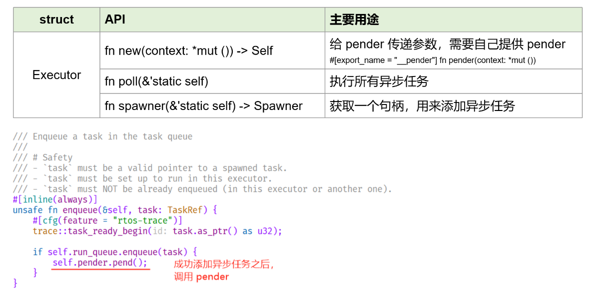
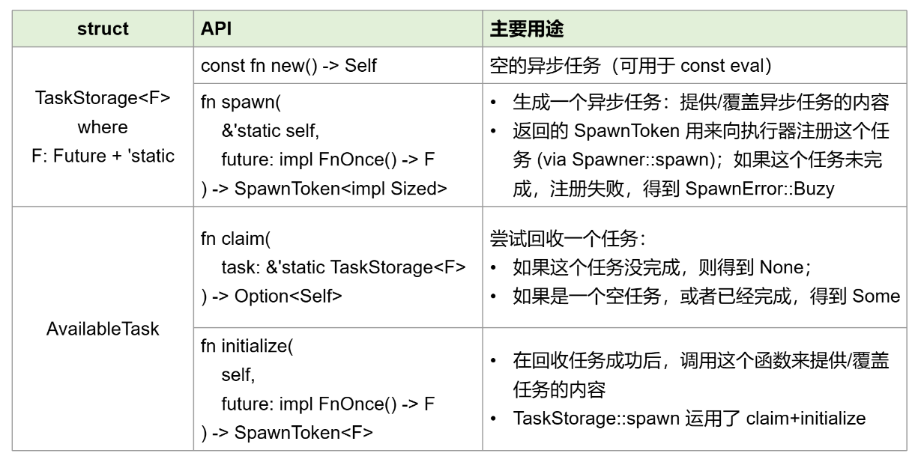
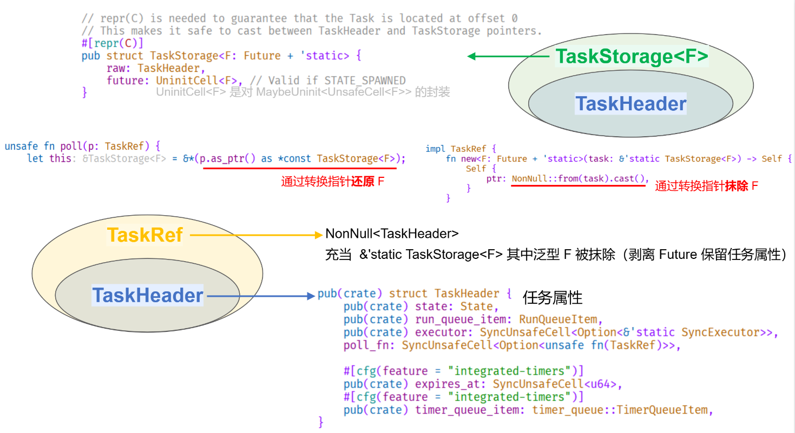

# embassy 使用记录之 TaskStorage

时间：2024-06-03

## 定时打印 (std/本机系统)

FYI: 这里使用 std 的原因在于更快地了解和测试 embassy。

```toml
[package]
name = "embassy-local"
version = "0.1.0"
edition = "2021"

[dependencies]
# log feature 不是必要的，但它可以明确表示不使用 defmt（因为它俩互斥）
# p.s. [defmt](https://defmt.ferrous-systems.com/) 是一个针对资源有限设备（微控制器）的日志库
embassy-time = { version = "0.3", features = ["std", "log"] }
# arch-std：使用标准库，因为跑在本机系统上
# nightly：运用 TAIT (type_alias_impl_trait) 来为每个任务分配到静态区，这需要 nightly Rust。
#          该功能不是必要的，没有它，则采用基于 bump allocator 的 arena（内存分配池）。
# executor-thread：在 executor 中启用 thread-mode，比如在某些架构中通过 WFI 来避免忙循环轮询
# integrated-timers：在 executor 中，集成基于 embassy-time 的计时器队列
embassy-executor = {
  version = "0.5",
  features = ["arch-std", "nightly", "executor-thread", "integrated-timers"]
}

# 日志不是必要的
env_logger = "0.11" # 日志初始化、格式化（比如颜色、时间、模块名）
log = "0.4" # 日志生态的核心库
```

```rust
// 如果你启用 embassy-executor 的 nightly feature，那么无需这一行 TAIT。
// 为了代码简洁，之后的代码我不再引入 #![feature(type_alias_impl_trait)]
#![feature(type_alias_impl_trait)]

// 任务 1：每隔 1 秒打印
#[embassy_executor::task]
async fn run1() {
    loop {
        log::info!("tick for 1 sec");
        embassy_time::Timer::after_secs(1).await;
    }
}

// 任务 2：每隔 2 秒打印
#[embassy_executor::task]
async fn run2() {
    loop {
        log::warn!("tick for 2 sec");
        embassy_time::Timer::after_secs(2).await;
    }
}

#[embassy_executor::main]
async fn main(spawner: embassy_executor::Spawner) {
    env_logger::builder().filter_level(log::LevelFilter::Debug).init();
    spawner.spawn(run1()).unwrap();
    spawner.spawn(run2()).unwrap();
}
```

```text
[2024-06-03T14:24:31Z WARN  embassy_local] tick for 2 sec
[2024-06-03T14:24:31Z INFO  embassy_local] tick for 1 sec
[2024-06-03T14:24:32Z INFO  embassy_local] tick for 1 sec
[2024-06-03T14:24:33Z WARN  embassy_local] tick for 2 sec
[2024-06-03T14:24:33Z INFO  embassy_local] tick for 1 sec
[2024-06-03T14:24:34Z INFO  embassy_local] tick for 1 sec
[2024-06-03T14:24:35Z WARN  embassy_local] tick for 2 sec
[2024-06-03T14:24:35Z INFO  embassy_local] tick for 1 sec
[2024-06-03T14:24:36Z INFO  embassy_local] tick for 1 sec
```


https://github.com/ch32-rs/ch32-hal/blob/main/src/embassy/time_driver_systick.rs#L48-L48C20

https://docs.rs/embassy-time/0.3.0/embassy_time/

https://docs.rs/embassy-time-driver/latest/embassy_time_driver/

https://docs.rs/embassy-executor/latest/embassy_executor/index.html

## `#[embassy_executor::task]` 展开

对于上述 `#[embassy_executor::task] async fn run1() { ... }`，宏展开如下

```rust
#[doc(hidden)]
async fn __run1_task() {
    loop {
        log::info!("tick for 1 sec");
        embassy_time::Timer::after_secs(1).await;
    }
}
fn run1() -> ::embassy_executor::SpawnToken<impl Sized> {
    type Fut = impl ::core::future::Future + 'static;
    const POOL_SIZE: usize = 1;
    static POOL: ::embassy_executor::raw::TaskPool<Fut, POOL_SIZE> =
        ::embassy_executor::raw::TaskPool::new();
    unsafe { POOL._spawn_async_fn(move || __run1_task()) }
}
```

注意：上面展开的代码可能随版本号而不同，所以仅供参考。

但依然可以看出当前 embassy-executor 对任务的一些设计：异步任务 `run1` 被改写成两个函数：
* `__run1_task` 保留了原异步函数的逻辑
* `run1` 为一个同步函数，其中对异步任务进行注册和初始化，然后返回一个 `SpawnToken`

在展开中的 `run1` 发生了一些有趣的事情：
* `SpawnToken` 是一个任务标记，作为 [`Spawner::spawn`] 函数的一个参数；当该任务已经在运行中，该标记是一个被污染的状态，再次 spawn 时返回
  [`SpawnError::Busy`]。该标记在 Drop 实现中会进行 panic，这意味着你必须把它按值传递给 spawn 函数进行处理，而不应该直接丢弃它。
* 由于 async fn/block 生成的 Future 是不可命名类型，需要使用 [TAIT] 来描述这个具体类型
* 异步任务存放在一个 TaskPool 中（它实质上是一个大小为 POOL_SIZE、元素为相同 Future 的静态数组），这个数组的长度为 1，意味着
  最多只能同时运行一个 `run1` —— 尤其是，当你连续两次 spawn 这个 run1，那么第二个 SpawnToken 会因为任务还在注册和运行的状态而受到污染，
  从而 spawn 时得到 Busy Error。然而，这并不意味着任务只能运行一次：任务完成之后，它依然在任务栈里面，只是状态并不是 spawned，执行器轮询时
  会跳过它，不过你依然可以索要（回收/重用）这个任务，具体代码见下文。

[TAIT]: https://github.com/rust-lang/rfcs/blob/master/text/2515-type_alias_impl_trait.md

[`Spawner::spawn`]: https://docs.rs/embassy-executor/latest/embassy_executor/struct.Spawner.html#method.spawn

[`SpawnError::Busy`]: https://docs.rs/embassy-executor/latest/embassy_executor/enum.SpawnError.html#variant.Busy

```rust
spawner.spawn(run1()).unwrap();

// 第二次运行任务 run1，会导致运行时错误
// called `Result::unwrap()` on an `Err` value: Busy
spawner.spawn(run1()).unwrap();
```

## `#[embassy_executor::task]` 限制

显然，当前 `#[embassy_executor::task]` 让任务执行具有如下限制：
1. 无法同时多次运行任务
2. 任务只能在编译时生成，无法在运行时生成
3. 函数参数无法包含泛型

对于上述所有限制，可以使用 `TaskStorage` 来创建任务，细粒度控制任务存放的位置和行为。我在下一节具体介绍。

对于第 1 个问题，`#[task]` 宏支持 `pool_size = n` 参数来指定这个静态数组的大小，从而让这个任务最多可以运行 n 次：

```rust
#[embassy_executor::task(pool_size = 2)]
async fn run1() {
    loop {
        log::info!("tick for 1 sec");
        embassy_time::Timer::after_secs(1).await;
    }
}
spawner.spawn(run1()).unwrap();
spawner.spawn(run1()).unwrap(); // ok :)
```

`pool_size` 背后是 [`TaskPool`]，如果你需要类型级别的控制，那么可以使用它。

[`TaskPool`]: https://docs.rs/embassy-executor/latest/embassy_executor/raw/struct.TaskPool.html


## `TaskStorage` 

[`TaskStorage`] 必须在程序（操作系统）运行期间永远存活，**即使该任务已经结束**。此外，在这个任务结束后，允许再次运行它。

这里存在一个不寻常的设计逻辑：如果说 [`Executor::run(&'static mut self, ...)`][Executor::run] 让执行器在整个程序运行过程中必须存活，是可以理解的，
但让任务的存活时间覆盖整个程序运行周期，似乎是一个比较极端的做法，毕竟任务的内存资源最好在结束后回收才符合常规。

个人猜测，这么设计的原因可能出于以下原因：
* embassy 主要用于嵌入式系统（甚至微控制器），这决定了硬件资源极其有限
* 并发的任务的数量不会特别多
* 内存大小尽量可控：
  * 当任务的大小是静态已知时，将 Future 存储在二进制的 data 段（`#[embassy_executor::task]` 被设计于此）
  * 当动态生成的任务被放置于堆上，适当地永久泄露内存是可接受的
  * 无论静态任务还是动态任务，任务内存都是可被重复利用的（见下一节）

所以，最终 [`TaskStorage::spawn`] 需要 `&'static self`。在 Rust 中获取 `&'static` 的方式主要有以下几种：
* const/static item：数据存放于二进制的数据段内，所以指向它的引用在程序运行期间永远有效
  * [constant expressions](https://doc.rust-lang.org/reference/const_eval.html#constant-expressions)：`&CONST`、`&STATIC`
  * [static promotion](https://zjp-cn.github.io/rust-note/forum/static-promotion.html)：`&const_eval`
  * footgun on `static mut`: 预计 2024 edition [禁止][114447] `&STATIC_MUT` 和 `&mut STATIC_MUT`（目前是警告），甚至有相当一部分社区共识决定以后弃用
    `static mut` ([pre-RFC 3560][3560])。主要是两点：意外的 `&'static mut` （正确做法：注意引用的生命周期、使用 `addr_of{,_mut}`
    直接创建指针而不是引用）和线程同步问题（正确做法：`SyncUnsafeCell`）。
* 通过解引用裸指针获得任意生命周期的引用：`&*raw_pointer` 、`&mut *raw_pointer`
  * 正确示例：`Box::leak` 数据存放于堆上，只要不主动回收内存，指向它的引用在此后的运行期间永远有效
  * 其他一些 `fn<'a>(...) -> &'a ...` 函数（注意返回值的生命周期不关联任何输入参数）：`slice::from_raw_parts{,mut}`
* `transmute`：一个危险的后门，利用它将临时的生命周期延长到 'static

[`TaskStorage`]: https://docs.rs/embassy-executor/latest/embassy_executor/raw/struct.TaskStorage.html
[Executor::run]: https://docs.rs/embassy-executor/latest/embassy_executor/struct.Executor.html#method.run
[`AvailableTask`]: https://docs.rs/embassy-executor/latest/embassy_executor/raw/struct.AvailableTask.html
[`TaskStorage::spawn`]: https://docs.rs/embassy-executor/latest/embassy_executor/raw/struct.TaskStorage.html#method.spawn
[114447]: https://github.com/rust-lang/rust/issues/114447
[3560]: https://github.com/rust-lang/rfcs/pull/3560

### 多次运行任务 / 动态生成任务

这将解除限制 1 和 2：

```rust
#[embassy_executor::main]
async fn main(spawner: embassy_executor::Spawner) {
    env_logger::builder().filter_level(log::LevelFilter::Debug).init();

    // 使用 run_n 重写 run1 + run2，打印结果是一样的
    spawner
        .spawn(run_n(1, || log::info!("tick for 1 sec")))
        .unwrap();
    spawner
        .spawn(run_n(2, || log::warn!("tick for 2 sec")))
        .unwrap();
}

// [ok] 任务 n：每隔 n 秒打印
fn run_n(n: u64, f: fn()) -> embassy_executor::SpawnToken<impl Sized> {
    // 在堆上泄露任务的内存
    let task = Box::leak(Box::new(embassy_executor::raw::TaskStorage::new()));
    task.spawn(move || async move {
        loop {
            f();
            embassy_time::Timer::after_secs(n).await;
        }
    })
}
```

FYI: 对于上述 `run_n` 任务，如果你使用 `#[embassy_executor::task]`，将遇到问题 1 和 2

```rust
#[embassy_executor::main]
async fn main(spawner: embassy_executor::Spawner) {
    env_logger::builder().filter_level(log::LevelFilter::Debug).init();

    spawner
        .spawn(run_n(1, || log::info!("tick for 1 sec")))
        .unwrap();

    // 限制 1：run_n 为单个任务，在未指定 pool_size 时，最多同时运行一次
    spawner
        .spawn(run_n(2, || log::warn!("tick for 2 sec")))
        .unwrap(); // 运行时错误：called `Result::unwrap()` on an `Err` value: Busy
}

// 限制 2：宏是静态编译的，任务只能在编译时生成，无法在运行时生成 
#[embassy_executor::task]
async fn run_n(n: u64, f: fn()) {
    loop {
        f();
        embassy_time::Timer::after_secs(n).await;
    }
}
```

### 泛型参数

这解决了限制 3

```rust
#[embassy_executor::main]
async fn main(spawner: embassy_executor::Spawner) {
    env_logger::builder().filter_level(log::LevelFilter::Debug).init();

    // 使用 run_n 重写 run1 + run2，打印结果是一样的
    spawner
        .spawn(run_n(1, || log::info!("tick for 1 sec")))
        .unwrap();
    spawner
        .spawn(run_n(2, || log::warn!("tick for 2 sec")))
        .unwrap();
}

// [ok] 任务 n：每隔 n 秒打印，注意 f 的类型不再是 fn，而是一个泛型
fn run_n<F: 'static + Fn()>(n: u64, f: F) -> embassy_executor::SpawnToken<impl Sized> {
    // 在堆上泄露任务的内存
    let task = Box::leak(Box::new(embassy_executor::raw::TaskStorage::new()));
    task.spawn(move || async move {
        loop {
            f();
            embassy_time::Timer::after_secs(n).await;
        }
    })
}
```


FYI: `#[embassy_executor::task]` 让泛型参数无法编译：


```rust
#[embassy_executor::main]
async fn main(spawner: embassy_executor::Spawner) {
    env_logger::builder().filter_level(log::LevelFilter::Debug).init();

    spawner
        .spawn(run_n(1, || log::info!("tick for 1 sec")))
        .unwrap();
}

// 限制 3：参数无法为泛型
#[embassy_executor::task]
async fn run_n<F: 'static + Fn()>(n: u64, f: F) {
    loop {
        f();
        embassy_time::Timer::after_secs(n).await;
    }
}

// 编译器错误
error: task functions must not be generic
  --> src/main.rs:16:1
   |
16 | async fn run_n<F: 'static + Fn()>(n: u64, f: F) {
   | ^^^^^^^^^^^^^^^^^^^^^^^^^^^^^^^^^^^^^^^^^^^^^^^
```

## 重用任务/重用任务内存

`#[embassy_executor::task]` 和 `TaskStorage` 都支持在任务结束之后再次通过 `spawn` 运行。

为了演示任务结束，代码没有使用 `loop`，也等待了足够长的时间。

```rust
// 使用 #[embassy_executor::task] 达到内存复用
// * 重新运行相同的任务
// * 或者在已完成的任务之后，通过函数指针参数指定新的任务内容

#[macro_use]
extern crate log;

use embassy_time::Timer;

#[embassy_executor::main]
async fn main(spawner: embassy_executor::Spawner) {
    env_logger::builder().filter_level(log::LevelFilter::Debug).init();

    spawner.spawn(run1()).unwrap();
    spawner.spawn(run_n(1, || info!("print in 1 sec"))).unwrap();

    Timer::after_secs(2).await; // 等待足够的时间让两个任务运行完

    spawner.spawn(run1()).unwrap(); // 任务的内容不变
    spawner.spawn(run_n(0, || warn!("print in 0 sec"))).unwrap(); // 新的任务内容
}

// 如前所述，run_n 最多同时运行运行一次
#[embassy_executor::task]
async fn run_n(n: u64, f: fn()) {
    Timer::after_secs(n).await;
    f();
}

// 如前所述，run1 最多同时运行运行一次
#[embassy_executor::task]
async fn run1() {
    Timer::after_secs(1).await;
    debug!("run 1");
}
```

```
[2024-06-07T08:28:00Z INFO  embassy_local] print in 1 sec
[2024-06-07T08:28:00Z DEBUG embassy_local] run 1
[2024-06-07T08:28:01Z WARN  embassy_local] print in 0 sec
[2024-06-07T08:28:02Z DEBUG embassy_local] run 1
```


而 TaskStorage 需要搭配 [`AvailableTask`] 才能重写任务：

```rust
// 对于 TaskStorage，使用 AvailableTask 对已完成的任务内存进行复用，
// 还有一个亮点在于通过泛型参数（而不是函数指针）来指定新任务。
// 技巧：任务为 &'static TaskStorage<BoxFut> 类型，它是 Copy 的

#[macro_use]
extern crate log;

use core::{future::Future, pin::Pin};
use embassy_executor::{
    raw::{AvailableTask, TaskStorage},
    SpawnToken,
};
use embassy_time::Timer;

#[embassy_executor::main]
async fn main(spawner: embassy_executor::Spawner) {
    env_logger::builder().filter_level(log::LevelFilter::Debug).init();

    // 同时运行两个不同的任务
    let (task1, token1) = run_n(1, || info!("print in 100 ms"));
    spawner.spawn(token1).unwrap();
    let (task2, token2) = run_n(2, || warn!("print in 200 ms"));
    spawner.spawn(token2).unwrap();

    Timer::after_secs(1).await; // 等待足够的时间，让那两个任务结束
    // 在 task1 内存中，建立新的任务并运行
    let token = AvailableTask::claim(task1).unwrap().initialize(|| Box::pin(async { info!("reclaim task1") }));
    spawner.spawn(token).unwrap();
    // 在 task2 内存中，建立新的任务并运行
    let token = AvailableTask::claim(task2).unwrap().initialize(|| Box::pin(async { info!("reclaim task2") }));
    spawner.spawn(token).unwrap();

    // 新的两个任务正在同时运行

    Timer::after_secs(1).await; // 等待足够的时间，让那两个新的任务结束
    // 再次重复利用任务内存，同时运行新的任务
    spawner.spawn(reclaim(task1, || async { warn!("reclaim task1 again :)") })).unwrap();
    spawner.spawn(reclaim(task2, || async { warn!("reclaim task2 again :)") })).unwrap();
}

type BoxFut = Pin<Box<dyn 'static + Future<Output = ()>>>;
type Task = &'static TaskStorage<BoxFut>;

// 任务 n：每隔 n * 100 毫秒打印
fn run_n<F: 'static + Fn()>(n: u64, f: F) -> (Task, SpawnToken<impl Sized>) {
    // 在堆上泄露任务的内存
    let task: &'static _ = Box::leak(Box::new(TaskStorage::new()));
    let token = task.spawn(move || {
        Box::pin(async move {
            Timer::after_millis(n * 100).await;
            f();
        }) as BoxFut
    });
    (task, token)
}

// 重新使用已经完成的任务内存，来生成新的任务
fn reclaim<F, Fut>(task: Task, f: F) -> SpawnToken<impl Sized>
where
    F: FnOnce() -> Fut,
    Fut: 'static + Future<Output = ()>,
{
    AvailableTask::claim(task).unwrap().initialize(|| Box::pin(f()))
}
```

```
[2024-06-07T07:40:42Z INFO  embassy_local] print in 100 ms
[2024-06-07T07:40:42Z WARN  embassy_local] print in 200 ms
[2024-06-07T07:40:42Z INFO  embassy_local] reclaim task2
[2024-06-07T07:40:42Z INFO  embassy_local] reclaim task1
[2024-06-07T07:40:43Z WARN  embassy_local] reclaim task2 again :)
[2024-06-07T07:40:43Z WARN  embassy_local] reclaim task1 again :)
```

## embassy_executor::raw 模块

一些我在第三周 PPT 里记录的总结，我不想重新在这写一遍，所以直接提供图片






## TaskStorage 及其变体

在 `embassy_executor` 中，任务会被表示为多种类型，但其实它们是一个东西，有时可以相互转化。


