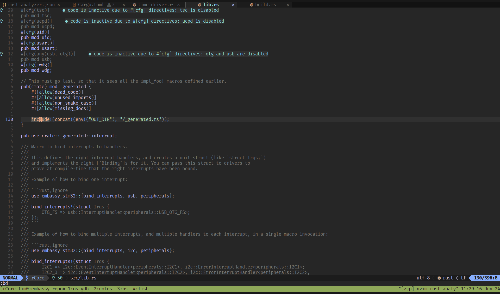

> 子模块 embassy 是修改过的 [embassy](https://github.com/embassy-rs/embassy) fork。

> 本文主要记录如何分析 embassy 仓库代码，而不是介绍具体的分析结果。
>
> 关于 embassy 分析结果，见我的 `embassy: ` 开头的训练营笔记文章。

# `rust-toolchain.toml`

`rust-toolchain.toml` 和 `rust-toolchain-nightly.toml` 是用来设置和固定 Rust 工具链版本号的。

有两个文件是因为 embassy 分别在 stable Rust 和 nightly Rust 上提供支持。

```toml
[toolchain]
channel = "1.79"
components = [ "rust-src", "rustfmt", "llvm-tools" ]
targets = [
    "thumbv7em-none-eabi",
    "thumbv7m-none-eabi",
    "thumbv6m-none-eabi",
    "thumbv7em-none-eabihf",
    "thumbv8m.main-none-eabihf",
    "riscv32imac-unknown-none-elf",
    "wasm32-unknown-unknown",
]
```

对本地分析源码，这基本没什么用，因为它主要用来进行 CI 测试。

我通常都会把这些工具链配置删除，当需要某个编译目标时（比如 `thumbv7em-none-eabi`），才通过
`rustup target add thumbv7em-none-eabi` 添加。

对于新手，如果你觉得手动设置这些很麻烦，可以不用动它，但代价是它会给你下载这整套工具链，需要安装时间和存储空间。

# `.vscode/settings.json`

对于 vscode 用户，首先查看 embassy 根目录的 `.vscode/settings.json` 配置文件，里面主要是用来配置 rust-analyzer (RA)。

根据我的经验，embassy 仓库的项目结构已经属于中大型规模，如果你对 Rust 的 [cargo](https://doc.rust-lang.org/cargo/)
组织方式不够熟悉，那么很难进行随心所欲地变动和配置。

我不会在这深入分析 embassy 的项目结构。但项目结构会决定你怎么配置 RA，比如说默认开启的 

* `"rust-analyzer.cargo.target": "thumbv7em-none-eabi"`：它要求你的工具链安装了 `thumbv7em-none-eabi` 目标，它会在每个被分析到的库上，给
  cargo 传递 `--target thumbv7em-none-eabi` 来让 RA 获取 rustc 发出的诊断。这对于代码分析不是必要的，至少在我分析某些库的时候 （executor、
  time），我不需要指定它。但它可能会影响内联汇编，因为汇编语法与编译目标相关（我没有尝试分析那部分，这只是猜测）。
* `"rust-analyzer.linkedProjects": [...]`：这实质上是手动指定一些项目让 RA 分析；它有多种使用方式，最常用的一种是指向子目录中的
  `Cargo.toml`，这是因为 `Cargo.toml` 代表所在的目录是一个 package。

  > **rust-analyzer.linkedProjects (default: [])**
  > 
  > Disable project auto-discovery in favor of explicitly specified set of projects.
  > 
  > Elements must be paths pointing to Cargo.toml, rust-project.json, .rs files (which will be treated as standalone files) or JSON objects in rust-project.json format.
  >
  > src: [RA user manual](https://rust-analyzer.github.io/manual.html)

* `"rust-analyzer.cargo.features": [...]`：这与你分析的项目有关，由于 embassy 默认设置 `embassy-stm32/Cargo.toml` 作为分析，embassy 帮你填了
  `embassy-stm32/Cargo.toml` 内的一些 features；如果你修改 `linkedProjects` 到别的库，那么填那个库的 features。

  ```json
    "rust-analyzer.cargo.features": [
      // Comment out these features when working on the examples. Most example crates do not have any cargo features.
      "stm32f446re",
      "time-driver-any",
      "unstable-pac",
      "exti",
      "rt",
    ],
  ```

# neovim 

> vscode 用户可以不必阅读这一节，你们只需要上面的步骤，然后右键选择一下就能看到宏展开。
>
> 但这里的介绍流程和细节并不会因为编辑器/开发环境的不同而完全割裂。

我并不是 vscode 用户，而是长期通过终端使用 neovim 编码。

但我也不会在这从头讲如何基于 neovim 搭建开发环境；如果你想知道我的配置，见 [此处](https://github.com/zjp-CN/nvim-config)。

neovim 中 Rust LSP 插件主要是 [rustaceanvim](https://github.com/mrcjkb/rustaceanvim)，一些要点：
* 项目布局：
  * 方式一：你可以使用上面 vscode 那样的 linkedProjects 配置，那么想办法让插件读取 RA 的配置文件就好
  * 方式二：由于 embassy 根目录不是 workspace 布局，所以我通常从终端进入某个库开始对它分析，把 `rust-analyzer.json` 放置在那个库的根目录
* RA 配置：
  * `"rust-analyzer.cargo.allFeatures": false`：因为 embassy 是重度条件编译和 feature 控制的，它的库不需要 allFeatures
    * 其实 allFeatures 已经被弃用，这里只是防止插件给你设置（我得到 [教训](https://github.com/rust-lang/rust-analyzer/issues/17371)）
  * `"rust-analyzer.cargo.features": [...]`：（可选的）填写这个库所需的 features
* embassy 同时也是重度使用宏的，尤其一些结合 build.rs + `include!` 进行编译时生成和展开源码的地方，更需要上面影响条件编译的选项配置正确
  * 在想要展开的宏上，调用 `:RustLsp expandMacro` 命令展开宏
  * 如果你想要通过 `cargo expand`，那么需要通过 `-F` 传递 features

# 条件编译和宏展开示例

综合示例：在 `embassy-stm32/src/lib.rs` 中，有一个 `include!(concat!(env!("OUT_DIR"), "/_generated.rs"))`，如果你没有传递 `stm32` 开头的 
feature，那么 RA 无法展开和分析其内部的代码。所以你需要类似于下面的配置

```json
{
  "rust-analyzer.cargo.features": ["time-driver-tim1", "stm32c011d6"]
}
```

才直接展开这个 `include!` 宏，得到 `_generated` 模块的实际内容[^_generated]：

[^_generated]: 如果通过 `cargo expand`，示例为 `cargo expand _generated -F stm32c011d6 | bat -l rust` 来展开 `_generated` 模块



并获得只对 `time_driver_tim1` 条件编译的分析结果：

```rust
// embassy-stm32/src/time_driver.rs
// 其中 peripherals 模块由 _generated.rs 编译时生成，它在源码中不存在
   40   #[cfg(time_driver_tim1)]
   41   type T = peripherals::TIM1;
  42   #[cfg(time_driver_tim2)]     ● code is inactive due to #[cfg] directives: time_driver_tim2 is disabled
   43   type T = peripherals::TIM2;
  44   #[cfg(time_driver_tim3)]     ● code is inactive due to #[cfg] directives: time_driver_tim3 is disabled
   45   type T = peripherals::TIM3;
```

这里有一个有趣的细节：cargo 的 `time-driver-tim1` feature 实际上只影响 `#[cfg(feature = "time-driver-tim1")]`
来进行条件编译，但我们并没有指定额外的 cfgs（比如 RA 配置 `"rust-analyzer.cargo.cfgs": ["time_driver_tim1"]`），那么
RA 是如何识别到 `#[cfg(time_driver_tim1)] type T = peripherals::TIM1;` 被启用呢？

答案在 build.rs 脚本里面，它在 Rust 编译前期编译和运行，主要帮助 package 做一些配置工作或者生成一些产物（代码文件/构建 C 库/等）。
它有一个重要的使用方式，是通过环境变量读取或者设置一些东西。

具体来说，在 embassy-stm32 的 build.rs 里会检查用户有没有开启 `time_driver` 开头的 feature，然后去除这个前缀，保留后面的
`tim1`，通过向标准输出打印 `cargo:rustc-cfg=time_driver_tim1` 达到开启 `time_driver_tim1` 这个 cfg flag 的目的。

这是 cargo 一个巧妙的设计：使用者可以只需要指定 `time-driver-tim1` feature，而无需再指定 `time_driver_tim1` cfg flag ——
这相当于向使用者隐藏了 cfg flag（使用者可以对它毫不知情），但同时给予库的编写者编写更复杂的条件编译的余地。虽然使用者依然可以设置
cfg flag（如果他们知道名称的话），但在实际情况中，这个设计减少了版本不兼容的风险，因为库会告知和鼓励使用 features，而不是 cfg 
flags。从这个角度看，单个 feature 可以视为多个 cfg flags 的集合（但 embassy-stm32 似乎并没有完全利用这一点，它只关联了一个 cfg flag）。

```rust
// src: https://github.com/embassy-rs/embassy/blob/86c48dde4192cabcad22faa10cabb4dc5f035c0a/embassy-stm32/build.rs#L182

// Handle time-driver-XXXX features.

let time_driver = match env::vars()
    .map(|(a, _)| a)
    .filter(|x| x.starts_with("CARGO_FEATURE_TIME_DRIVER_"))
    .get_one()
{
    Ok(x) => Some(
        x.strip_prefix("CARGO_FEATURE_TIME_DRIVER_")
            .unwrap()
            .to_ascii_lowercase(),
    ),
    Err(GetOneError::None) => None,
    Err(GetOneError::Multiple) => panic!("Multiple stm32xx Cargo features enabled"),
};

let time_driver_singleton = match time_driver.as_ref().map(|x| x.as_ref()) {
    None => "",
    Some("tim1") => "TIM1",
    ...
    _ => panic!("unknown time_driver {:?}", time_driver),
};

if !time_driver_singleton.is_empty() {
    cfgs.enable(format!("time_driver_{}", time_driver_singleton.to_lowercase()));
}

// src: https://github.com/embassy-rs/embassy/blob/86c48dde4192cabcad22faa10cabb4dc5f035c0a/embassy-stm32/build_common.rs#L36-L40
impl CfgSet {
    /// Enable a config, which can then be used in `#[cfg(...)]` for conditional compilation.
    ///
    /// All configs that can potentially be enabled should be unconditionally declared using
    /// [`Self::declare()`].
    pub fn enable(&mut self, cfg: impl AsRef<str>) {
        if self.enabled.insert(cfg.as_ref().to_owned()) {
            println!("cargo:rustc-cfg={}", cfg.as_ref());
        }
    }
}
```

# features

首先要明确的是，当我们在 Rust 中谈论 feature，需要确定上下文：

* nightly/unstable feature 通常指 nightly Rust 中才可用的、实验性的功能，你可以在 [unstable book]
  查阅到这个列表。它可以划分为 language feature 和 library feature 两部分，但都使用 `#![feature(...)]` 语法启用功能。
    * language feature：由 [lang team] 负责来设计 Rust 语言（语法、语义、规范），比如 [`#![feature(lang_items)]`][lang_items]
    * library feature：由 [library team] 负责，在标准库（含 core lib）添加新的 APIs，比如 [`#![feature(waker_getters)]`][waker_getters]
* 在使用一个库的时候，[feature] 通常指这个 [crate] （库或者可执行程序） 在其 Cargo.toml 文件中定义的内容，用于条件编译或者指定可选依赖 
    * features 的定义具有两部分来源：
        * `[features]` 中定义的键：因此一个 feature 可以是多个其他 feature 的集合
        * 被指定为 `optional = true` 的依赖
    * 库的编写者在源码中使用 `#[cfg(feature = "...")]` 将代码进行条件编译控制，而库的使用者在 Cargo.toml 中，在这个依赖声明时指定 features 
    * 示例：库 a 包含 `#[cfg(feature = "gated")] pub fn f() {}` 函数，使用者想使用 `a::f()`，必须在配置文件中启用（比如直接写
      `[dependencies] a = { version = "...", features = ["gated"] }]` 或者其他间接方式）
    * 所以库的 features 改动应该视为公共 API 的一部分，需要进行版本兼容性的考虑 ([SemVer][featuers-SemVer])
        * 在 embassy 中，存在一些 `_` 开头的 features，这是一种社区做法，用于表明这些 features 不应被使用者直接使用，从而作为库内部的细节而不遵循版本语义

[unstable book]: https://doc.rust-lang.org/unstable-book/the-unstable-book.html
[lang team]: https://github.com/rust-lang/lang-team
[lang_items]: https://doc.rust-lang.org/unstable-book/language-features/lang-items.html
[library team]: https://github.com/rust-lang/libs-team
[waker_getters]: https://doc.rust-lang.org/unstable-book/library-features/waker-getters.html

[crate]: https://doc.rust-lang.org/cargo/appendix/glossary.html#crate
[featuers-SemVer]: https://doc.rust-lang.org/cargo/reference/features.html#semver-compatibility
[cfg-vs-features]: https://doc.rust-lang.org/reference/conditional-compilation.html#set-configuration-options
[feature]: https://doc.rust-lang.org/cargo/reference/features.html

这里讨论库的 features（也指 Cargo features）。

可以说 features 是 [cfg][cfg-vs-features] 在 Cargo 的一个特殊化：
* features 被设计为累加式的，这意味着库应该尽量将默认开启的 features 降到最低
* cargo 有一系列 features 的细节设计：不限于
    * 命令行选择参数 `--features a,b,c`、`--all-features`、`--no-default-features`
    * `[features]` 中支持的 `dep:` 和 `?` 语法
    * [check-cfg]：这是 2024 年 Cargo 重点推进的一个大功能（对应于 2020 年创建的 [RFC#3013]）

`check-cfg` 解决的问题很直观：检查 cfg 选项的 key 和 value 是否有效，即如果源码中写了 `cfg(key)` 或 `cfg(key = value)`，那么 `key` 和 `value` 应该被定义。

[RFC#3013]: https://github.com/rust-lang/rfcs/pull/3013
[check-cfg]: https://blog.rust-lang.org/inside-rust/2024/06/19/this-development-cycle-in-cargo-1.80.html#-zcheck-cfg

比如当你过去直接写 `#[cfg(aaa)]`，Rust 不会对这个 `aaa` 选项名做任何检查，显然这会带来风险；现在（目前在 nightly Rust
中），你会碰到来自 rustc 友好的提示（也会出现在 IDE 中），告知你当前有效的名称和处理它的方式：

```rust
#[cfg(aaa)] // 自定义的 cfg flag
fn f() {}

warning: unexpected `cfg` condition name: `aaa`
  --> src/bin/borrow.rs:38:7
   |
38 | #[cfg(aaa)]
   |       ^^^
   |
   = help: expected names are: `clippy`, `debug_assertions`, `doc`, `docsrs`, `doctest`, `feature`, `miri`, `overflow_checks`, `panic`, `proc_macro`, `relocation_model`, `r
ustfmt`, `sanitize`, `sanitizer_cfi_generalize_pointers`, `sanitizer_cfi_normalize_integers`, `target_abi`, `target_arch`, `target_endian`, `target_env`, `target_family`, `
target_feature`, `target_has_atomic`, `target_has_atomic_equal_alignment`, `target_has_atomic_load_store`, `target_os`, `target_pointer_width`, `target_thread_local`, `targ
et_vendor`, `test`, `ub_checks`, `unix`, and `windows`
   = help: consider using a Cargo feature instead
   = help: or consider adding in `Cargo.toml` the `check-cfg` lint config for the lint:
            [lints.rust]
            unexpected_cfgs = { level = "warn", check-cfg = ['cfg(aaa)'] }
   = help: or consider adding `println!("cargo::rustc-check-cfg=cfg(aaa)");` to the top of the `build.rs`
   = note: see <https://doc.rust-lang.org/nightly/rustc/check-cfg/cargo-specifics.html> for more information about checking conditional configuration
   = note: `#[warn(unexpected_cfgs)]` on by default
```

查找这个选项定义的地方有：
* rustc's list of "well known" cfgs (generally first party compilation toolchains)：比如上面 target 开头和相关的名称
* cargo's list of "well known" cfgs：比如 clippy、doc、docsrs、miri
* [`[features]`](https://doc.rust-lang.org/cargo/reference/features.html)：在 Cargo.toml 中定义
* [`cargo::rustc-check-cfg`](https://doc.rust-lang.org/nightly/cargo/reference/build-scripts.html#rustc-check-cfg)：通过 build.rs 传递编译时的环境变量
* Passing `--check-cfg` through `RUSTFLAGS`

如果你确认想忽略这个检查 cfg 选项的噪音，则采用以下一种方式：
* 模块内使用 `#![allow(unexpected_cfgs)]` （貌似暂不能识别 item 上的 `#[allow(unexpected_cfgs)]`）
* 在 Cargo.toml 中 `[lints.rust]` 定义 `unexpected_cfgs`，help 信息已经给了示例

目前这是一个夜间功能，不过预计在 7 月 Rust 1.80 上稳定。（见 [cargo 1.80 开发报告][cargo-1.80]）

[cargo-1.80]: https://blog.rust-lang.org/inside-rust/2024/06/19/this-development-cycle-in-cargo-1.80.html#-zcheck-cfg

embassy 在 5 月合并了添加 check-cfg 功能的 [PR#3005]，它是一个很好的示例，尤其值得学习在 build.rs 中把
`cargo::rustc-check-cfg` （定义选项） 和 `cargo::rustc-cfg` （开启选项）结合起来使用的技巧。

[PR#3005]: https://github.com/embassy-rs/embassy/pull/3005
