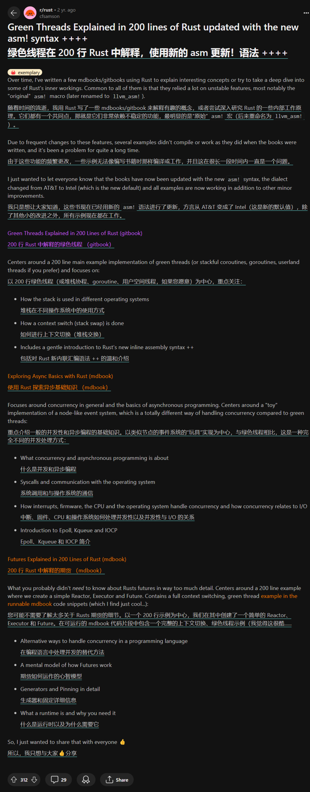

# 背景

由于原作者 cfsamson 写这些代码的时候依赖当时不稳定的 Rust 功能（比如
`asm!`、`#[naked]`），这些功能已经随着时间而发生了巨大的变化。

这导致回看当时一些文章翻译提供的代码是过时的
* [stevenbai: 200行代码讲透RUST FUTURES](https://stevenbai.top/rust/futures_explained_in_200_lines_of_rust/)
* [耿腾: 两百行Rust代码解析绿色线程原理（五）附录：支持 Windows](https://zhuanlan.zhihu.com/p/101168659)

而原文链接已经逐渐消失在网上（由原作者自己删除[^1]），不过幸运的是，这些原文内容还留有存档
* [Futures Explained in 200 Lines of Rust](https://web.archive.org/web/20230203001355/https://cfsamson.github.io/books-futures-explained/introduction.html)
* [Green Threads Explained in 200 Lines of Rust](https://web.archive.org/web/20220527113808/https://cfsamson.gitbook.io/green-threads-explained-in-200-lines-of-rust/supporting-windows)

[^1]: cfsamson 在几个月前正式发布了他的新书
《[Asynchronous Programming in Rust: Learn asynchronous programming by building working examples of futures, green threads, and runtimes][cfsamson-book]》（[原帖]），
将他以往的异步系列书整合到了一起，有条件的小伙伴可以支持他。

值得注意的是，两百行讲解绿色线程的代码其实在两年前就由原作者本人更新了一次（[帖子][post-update]），上面的存档记录了当时更新过的代码版本，它们是直接可以被运行了。

点击展开/收起原作者发布代码更新的帖子的截图

[cfsamson-book]: https://www.amazon.com/Asynchronous-Programming-Rust-asynchronous-programming/dp/1805128132
[原帖]: https://www.reddit.com/r/rust/comments/1amlro1/new_rust_book_asynchronous_programming_in_rust_is/
[post-update]: https://www.reddit.com/r/rust/comments/seb0ex/green_threads_explained_in_200_lines_of_rust/

# 代码仓库

> 地址：<https://gitee.com/ZIP97/green-thread>

cfsamson 的代码仓库自然也被他自己删除了，所以这个仓库记录的代码主要是由我搜集和改动的。

## `cargo r --bin green-thread`

green-thread 位于 `src/main.rs`，是参照更新过的源码，我稍微改动了一下：
* 将不同目标平台的条件编译代码拆分到模块
* 修复 clippy 的建议
* 目前在 x86-64 架构上 Ubuntu 22.04 LTS 和 Windows11 机器上已经测试通过
* 由于仍然使用 `#[naked]` 这个夜间功能，你需要 nightly Rust 才能运行它

## `cargo r --bin full`

full 位于 `src/bin/full.rs`，这是原作者更新过的源码，green-thread 基于它。

## `cargo r --bin linux-only`

linux-only 位于 `src/bin/linux-only.rs`，是参照未更新的代码（来自中文翻译的 200 行讲 Futures），在训练营第三阶段第一周和“人造人”一起改的。

修复一些错误和警告，并增加了一些日志式的打印，它可以跑在 stable Rust 中，因为 `#[naked]` 被替换成了类似 rCore 那样的纯汇编写法。

它无法在 Windows 上跑通，如果你想解决它，需要阅读我上面给的英文原文，里面介绍了支持 Windows 系统的思路，或者直接研究/运行 green-thread 代码。

# `asm!` 宏

`asm!` 用于内联汇编，这在我之前的 [笔记](./async-os-rust-futures.md) 中有总结一些，这里不重复了。

重点阅读官方材料：[RBE: asm!] 和 [Reference: inline assembly]。

[RBE: asm!]: https://doc.rust-lang.org/stable/rust-by-example/unsafe/asm.html
[Reference: inline assembly]: https://doc.rust-lang.org/stable/reference/inline-assembly.html

# `#[naked]` 属性

> 这部分内容整理自 [RFC#2972: naked]

[RFC#2972: naked]: https://github.com/rust-lang/rfcs/blob/master/text/2972-constrained-naked.md

`#[naked]` 用于声明一个裸函数 (naked function) ，它其实一直就存在于 Rust 编译器中，但它至今仍需要通过开启 `#![feature(naked_functions)]` 才能使用。

历史上，由于缺少 prologue 和 epilogue 的函数会带来许多复杂的问题，Rust 编译器需要解决这些问题，开发人员需要解决这些问题。长期以来，编译器和开发人员都犯了错误。

所以目前 `#[naked]` 只能作用于某些特定的函数，通过约束来让裸函数更加有用：

| 约束/要求                                                            | 原因                                                                                                                                                                                                                                  |
|----------------------------------------------------------------------|---------------------------------------------------------------------------------------------------------------------------------------------------------------------------------------------------------------------------------------|
| 需指定除 `extern "Rust"` 之外的调用约定（比如 `extern "C"`）         | 由于 `extern "Rust"` 调用约定未定义，因此不建议使用它，因此应指定定义明确的调用约定                                                                                                                                                   |
| 应仅定义 FFI 安全参数和返回类型                                      | 由于 `asm!()` 语句可以通过调用约定访问函数参数，因此参数本身应该是 FFI 安全的，以确保可以从汇编中可靠地访问它们                                                                                                                       |
| 不得指定 `#[inline]` 或 `#[inline(*)]` 属性                          | 由于裸函数非常依赖调用约定，因此内联这些函数将使代码生成变得极其困难，从而不允许内联                                                                                                                                                  |
| 函数体内部只能有一个 `asm!()` 语句，该语句可以包裹在  unsafe 块中    | 由于裸函数没有 prologue，因此任何使用栈的幼稚尝试都可能产生无效代码，比如使用局部变量、引用可能放置在栈上的函数参数。                                                                                                                 |
| 该 `asm!()` 语句只允许 const 或 sym 操作数                           | const 和 sym 操作数既不修改堆栈也不修改寄存器，因此允许使用它们                                                                                                                                                                       |
| 该 `asm!()` 语句必须包含 `options(noreturn)`                         | 由于许多平台将返回地址存储在栈上，因此 `asm!()` 语句有责任以适当的方式返回                                                                                                                                                            |
| 该 `asm!()` 语句不得包含除 noreturn 和 att_syntax 之外的任何其他选项 |  （我猜测是因为其他 [选项][options] 限制了读写内存的行为，这显然不适用于裸函数）                                                                                                                                                                                                                                     |
| 该 `asm!()` 语句必须确保遵循调用约定，否则该函数为 unsafe            | （调用约定保证了能够通过汇编代码来访问函数参数）                                                                                                                                                                                                                                       |

[options]: https://doc.rust-lang.org/stable/reference/inline-assembly.html#options

> 还有一个重要的限制：无法在 Rust 中使用函数参数。
> 
> 任何使用函数参数（即便用作操作数）的尝试都可能导致栈访问或修改。同样，任何寄存器操作数都可能导致编译器尝试在栈上保留寄存器。由于该函数没有 prologue，因此这是有问题的。为了避免这个问题，我们只是拒绝允许在 Rust 中使用任何函数参数。
> 
> 为了重新启用对函数参数的访问，编译器会确保 `asm!()` 语句中寄存器的初始状态符合函数的调用约定。这允许开发人员通过调用约定，手动编写汇编来访问函数参数。
>
> 也就是说，必须通过汇编代码和调用约定来访问函数参数，而不能直接在 Rust 代码中访问它们。

# 名词解释

【点击展开或者收起】来自 kimi (AI)，仅供参考。

## clobbered registers

在汇编语言编程和计算机体系结构中，"clobbered registers"（被破坏的寄存器）是指那些在函数调用或中断处理过程中，其内容可能会被改变的寄存器。这些寄存器在函数调用之前应该被保存，因为调用者不能假设它们在函数返回后仍然保持原来的值。

在不同的编程环境和调用约定中，哪些寄存器被认为是被破坏的可能会有所不同。以下是一些常见的情况：

1. **函数调用约定**：在许多编程语言和平台中，都有一组调用约定（calling conventions），这些约定定义了哪些寄存器是被破坏的。例如，在C语言中，根据使用的平台和编译器，可能会有一组约定的寄存器，它们在函数调用时可以被自由使用，而不需要保存调用者的原始值。

2. **系统调用**：在进行系统调用时，操作系统可能会使用特定的寄存器来传递参数，这些寄存器的内容在系统调用之后可能会改变。

3. **中断处理**：在中断处理程序中，中断服务例程（ISR）可能会使用或修改一组特定的寄存器，因此在中断处理之前，这些寄存器的原始值需要被保存。

4. **异常和信号处理**：在异常或信号处理程序中，可能会有一组寄存器被用来传递异常或信号的上下文，这些寄存器的内容在处理程序执行期间可能会被改变。

5. **协程和纤程**：在协程或纤程的上下文中，当从一个协程切换到另一个协程时，可能会有一组寄存器需要被保存和恢复，以保持每个协程的状态。

在编写汇编代码时，程序员需要知道哪些寄存器是被破坏的，并确保在函数或中断处理程序的开始和结束时适当地保存和恢复这些寄存器的值。这通常通过将寄存器的值推入堆栈（pushing onto the stack）来完成，在函数或中断处理程序结束前再将它们弹出（popping from the stack）。

## clobber constraints

在汇编语言和低级编程中，特别是在使用内联汇编或与高级语言交互时，"破坏约束"（clobber constraints）是一种特殊的指令，用于指示汇编代码中的哪些寄存器或内存位置可能被汇编代码修改，因此它们的原始值不会被保留。

以下是破坏约束的几个关键点：

1. **寄存器修改**：汇编代码可能会修改（即破坏）一个或多个CPU寄存器的内容。当汇编代码执行完毕后，这些寄存器将不再包含它们原始的值。

2. **内存影响**：除了寄存器，汇编代码还可能修改内存位置。如果汇编代码访问了某个内存地址并改变了它的值，这也被视为破坏。

3. **调用约定**：在函数调用中，特定的寄存器可能被约定用于传递参数或保存返回值。如果这些寄存器在函数调用中被修改，它们就被认为是被破坏的。

4. **编译器优化**：破坏约束对于编译器优化很重要。编译器需要知道哪些值在汇编代码块执行后不能被假设为未改变，以避免潜在的错误。

5. **内联汇编**：在使用内联汇编时，程序员需要明确指出哪些寄存器或内存位置是被破坏的，这样编译器就可以正确地安排寄存器使用和内存访问。

6. **约束指示**：在某些语言的内联汇编语法中，比如 Rust，可以使用特定的语法来指示破坏约束，例如 `lateout("reg")` 表示某个寄存器在汇编代码执行后将被修改。

7. **保护调用者环境**：破坏约束确保汇编代码不会无意中使用或覆盖调用者环境中的重要值，从而保护调用者的环境。

8. **明确性**：明确指出哪些寄存器或内存位置将被破坏，有助于其他程序员理解汇编代码的行为，并在编写调用此汇编代码的高级语言代码时做出适当的安排。

破坏约束是低级编程中的一个重要概念，它帮助确保汇编代码的副作用被正确地理解和管理。

## prologue & epilogue

在汇编语言和系统编程中，"prologue"和"epilogue"是函数或过程的两个关键部分，它们分别对应于函数调用的开始和结束。下面是对这两个术语的详细解释：

1. **Prologue（序言/开始部分）**：
   - 函数的prologue是函数体开始时执行的代码，通常包括以下几个步骤：
     - 保存旧的栈帧基址。在x86架构中，这通常通过将当前栈顶指针`ESP`（或在x86-64中是`RSP`）压入栈来完成。
     - 调整栈指针以分配新的栈帧。这可能涉及到将栈指针减去一定数值来为局部变量腾出空间。
     - 保存寄存器。如果函数需要修改某些寄存器的值，而这些寄存器的原始值需要在函数返回后仍然可用，则需要将这些寄存器的值压入栈中保存。
   - Prologue的目的是为了设置函数的执行环境，包括为局部变量分配空间和保存必要的寄存器状态。

2. **Epilogue（结束部分）**：
   - 函数的epilogue是函数体结束前执行的代码，通常执行以下操作：
     - 恢复寄存器状态。这可能涉及到将之前保存在栈中的寄存器值恢复到它们的原始状态。
     - 恢复栈指针。撤销在prologue中对栈指针所做的调整，以便栈指针指向函数调用前的栈顶。
     - 从栈中弹出返回地址（如果使用了`call`或`ret`指令）。
     - 最后，执行`ret`指令返回到调用者。
   - Epilogue的目的是清理函数的执行环境，确保调用者的环境没有被破坏，并且正确地将控制权返回给调用者。

3. **调用约定**：
   - 函数的prologue和epilogue的实现细节可能会根据使用的调用约定（calling convention）而有所不同。调用约定定义了函数参数如何传递、哪些寄存器是易失的（可能会被破坏），以及哪些是持久的（需要被保存）。

4. **重要性**：
   - 正确编写prologue和epilogue对于确保程序的正确性和性能至关重要。它们确保了函数调用的栈平衡，以及寄存器状态的正确保存和恢复。

5. **汇编语言中的实现**：
   - 在汇编语言中，程序员需要手动编写prologue和epilogue代码。这要求对底层硬件和调用约定有深入的理解。

6. **高级语言中的抽象**：
   - 在大多数高级编程语言中，编译器会自动生成prologue和epilogue代码，从而抽象出这些底层细节，让程序员能够更专注于业务逻辑。

总的来说，prologue和epilogue是函数调用机制中的基础部分，它们确保了函数调用的原子性和调用者与被调用者之间的正确交互。

## naked function

"naked function"（裸函数）是编程中的一个术语，通常用于C和C++等语言，指的是一个不包含任何prologue（序言）和epilogue（尾声）的函数。在这些函数中，编译器不自动插入标准的函数调用开销，如栈帧的建立和销毁、寄存器保存和恢复等。裸函数由程序员完全控制其汇编代码，包括所有的入口和退出序列。

以下是裸函数的一些关键特点：

1. **手动栈管理**：程序员需要手动处理栈的操作，包括但不限于为局部变量分配空间和调整栈指针。

2. **寄存器使用自由**：在裸函数中，程序员可以自由使用任何寄存器，而不必担心编译器会为它们生成保存和恢复的代码。

3. **性能优化**：由于省去了prologue和epilogue的开销，裸函数可以提供更好的性能，特别是在那些执行时间非常短的函数中。

4. **调用约定**：即使函数是裸的，程序员仍需要遵守特定的调用约定，以确保参数和返回值的正确传递。

5. **错误风险**：由于缺少自动的栈帧管理，裸函数增加了出错的风险，比如栈溢出或破坏调用者的栈状态。

6. **使用场景**：裸函数通常用在对性能要求极高的场景，或者需要与特定硬件紧密交互的代码中。

7. **示例**：在C或C++中，可以通过`__attribute__((naked))`（GCC）或`naked`关键字（MSVC）来声明一个裸函数。

8. **高级语言中的使用**：在大多数情况下，高级语言的程序员不需要编写裸函数，因为编译器会自动处理函数调用的开销。然而，在系统编程或者嵌入式编程中，裸函数可能是必须的。

9. **安全和可维护性**：由于裸函数需要手动管理底层细节，它们可能会降低代码的可维护性和安全性。

10. **跨平台问题**：不同平台和编译器可能有不同的调用约定和ABI（应用程序二进制接口），编写裸函数时需要考虑这些差异。

裸函数提供了对函数执行的完全控制，但同时也要求程序员具备深入的硬件和汇编语言知识。

