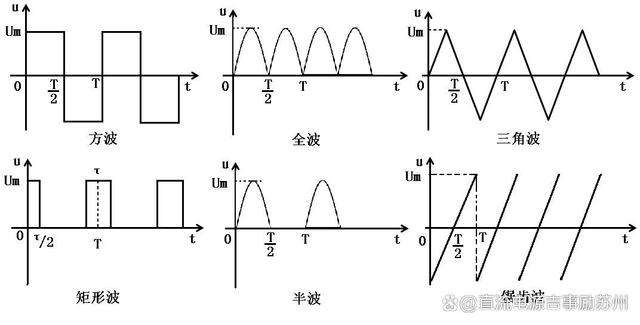
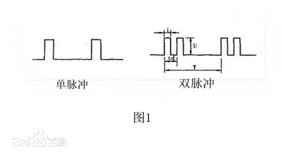
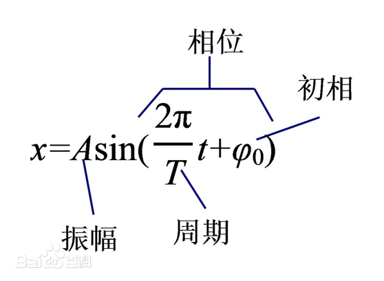
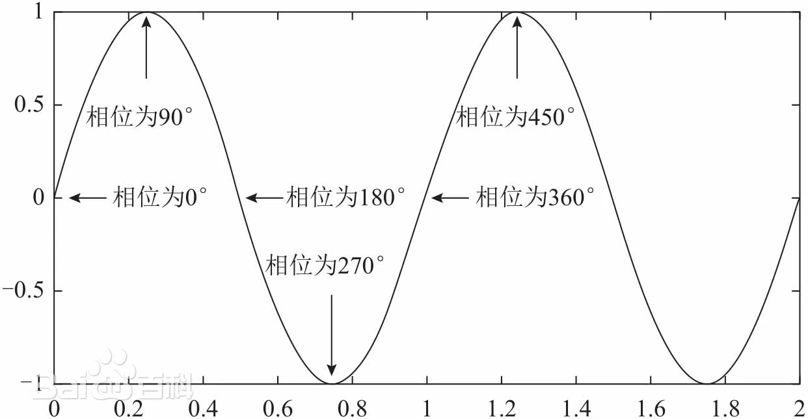
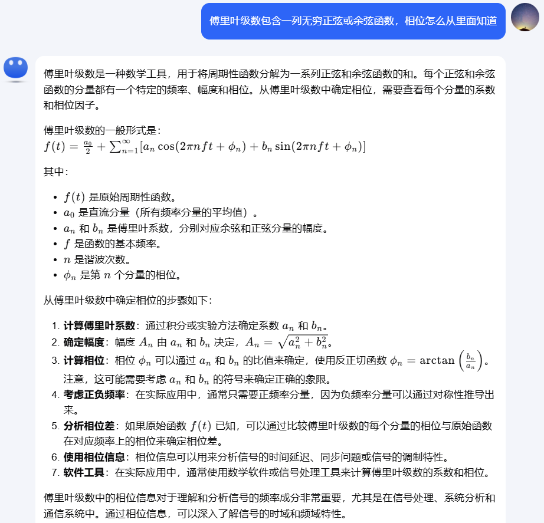

记录我查的专业名词，大部分解释来自 kimi (AI)。

# 预分频器

预分频器在英文中通常被称为 "Prescaler" 或 "Clock Divider"。

预分频器是一种电子设备，常用于降低时钟频率，以适应不同设备或电路的需要。在数字电路设计中，预分频器通常用于将主时钟信号的频率降低到一个较低的频率，这样可以使数字电路在较低的时钟频率下工作，降低功耗，同时可能提高系统的稳定性。

预分频器的工作原理通常基于一个计数器，该计数器在接收到一定数量的输入时钟脉冲后输出一个脉冲。例如，如果预分频器设置为2，那么它将在接收到2个输入时钟脉冲后输出一个脉冲。这样，输出频率就是输入频率的一半。

预分频器可以是简单的二进制计数器，也可以是更复杂的数字电路，具有可编程的分频比或可调节的分频范围。在某些应用中，预分频器还可以用于生成相位差或同步信号，以满足特定的时序要求。

## 时钟脉冲

时钟脉冲在英文中称为 "Clock Pulse"。在数字电路和计算机科学中，时钟脉冲是时钟信号的单个周期，通常用来同步电路中的操作和数据传输。

## 时钟信号

时钟信号在英文中被称为 "Clock Signal"。它是数字电路中用来同步各种操作的周期性信号，通常表现为一系列的脉冲。在计算机和其他电子设备中，时钟信号是控制数据传输和处理速度的关键因素。

## 时钟周期

在数字电子和计算机科学中，时钟周期是时钟信号的一个完整周期，包括上升沿和下降沿。它是衡量时钟频率和同步数字电路操作的基本单位。以下是关于时钟周期的一些关键点：

1. **定义**：时钟周期是时钟信号从0变到1再变回0所需的时间，或者从1变到0再变回1所需的时间。

2. **频率与周期**：时钟频率（以赫兹Hz为单位）是时钟周期的倒数。换句话说，如果一个时钟的频率是1MHz，那么它的周期是1秒的百万分之一，即1微秒（μs）。

3. **数字电路同步**：在数字电路中，时钟周期用于同步电路中的各个部分，确保数据在正确的时刻被读取或写入。

4. **处理器操作**：在计算机处理器中，一个时钟周期通常对应于执行一个最基本的操作，如数据的读取、写入或算术逻辑运算。

5. **内存访问**：内存和其他系统组件的访问速度通常以时钟周期为基准来定义，例如，一个具有4个时钟周期的内存访问时间意味着访问数据需要4个时钟周期。

6. **性能指标**：时钟周期的大小直接影响系统的性能。较短的时钟周期意味着较高的频率和更快的操作速度。

7. **时钟偏斜和抖动**：在高速数字系统中，时钟信号的稳定性非常重要，时钟偏斜（时钟信号在不同位置到达的时间差异）和抖动（时钟信号边缘的不稳定性）都可能影响系统的性能和可靠性。

8. **时钟分频**：在某些系统中，时钟信号可能会通过分频器进行分频，以生成不同频率的时钟信号供不同部分的电路使用。

9. **实时系统**：在实时系统中，时钟周期的准确性对于保证任务在预定时间内完成至关重要。

10. **电源管理**：时钟频率也与设备的能耗有关，较高的频率可能会增加功耗，因此在设计时需要在性能和能效之间做出权衡。

> 问：时钟周期和指令周期的区别和联系
> 
> 答：时钟周期和指令周期是计算机科学中两个相关但不同的概念，它们在处理器操作和性能评估中扮演重要角色。以下是它们的区别和联系：
> 
> * 时钟周期（Clock Cycle）
> 
>   1. **定义**：时钟周期是时钟信号的一个完整周期，包括上升沿和下降沿。它是计算机中最基本的时间单位，用于同步电路的操作。
>   2. **频率**：时钟频率（以赫兹Hz为单位）是时钟周期的倒数。例如，1GHz的时钟频率意味着有10亿个时钟周期每秒。
>   3. **同步**：时钟周期用于同步处理器内部的所有操作，确保数据在正确的时刻被处理。
> 
> * 指令周期（Instruction Cycle）
> 
>   1. **定义**：指令周期是处理器执行一条指令所需的时间。它通常由多个时钟周期组成，具体数量取决于指令的复杂性和处理器的设计。
>   2. **执行过程**：一个指令周期通常包括取指（Fetch）、解码（Decode）、执行（Execute）、访存（Memory Access）、写回（Write-back）等阶段。
>   3. **复杂性**：不同的指令可能需要不同数量的时钟周期来完成。例如，简单的算术操作可能只需要几个时钟周期，而复杂的操作可能需要更多。
> 
> * 区别
> 
>   1. **时间单位**：时钟周期是处理器操作的基本时间单位，而指令周期是完成一条指令所需的时间跨度。
>   2. **组成**：一个指令周期可能由多个时钟周期组成，具体取决于指令的执行需求。
>   3. **依赖性**：指令周期依赖于时钟周期来同步其执行过程，但不是所有时钟周期都直接对应于指令的执行。
> 
> * 联系
> 
>   1. **基础**：指令周期是建立在时钟周期基础之上的，没有时钟周期，指令周期就无法定义。
>   2. **性能评估**：两者都用于评估处理器的性能。较高的时钟频率通常意味着较短的时钟周期，可能允许更快的指令执行。
>   3. **设计考量**：在处理器设计中，时钟周期的长度会影响指令周期的长度和处理器的整体性能。

# 信号

在数字电路和计算机科学领域，"信号"一词通常指的是在电路或系统中传输的信息载体。在时钟信号的语境下，"信号"指的是电信号，它按照一定的频率和电压水平变化，以控制电路中的同步操作。这种信号通常由时钟发生器（Clock Generator）或振荡器（Oscillator）产生，并在电路板或系统中的各个部分之间传播，以确保数据在正确的时间被处理或传输。

时钟信号的"信号"一词，在这里特指电信号，它是数字逻辑电路中不可或缺的组成部分。

> 问：这种信号实质上是电压的变化？
> 
> 答：是的，时钟信号在实质上是电压的变化。在数字电路中，时钟信号通常表现为两种电压状态：高电平和低电平，对应于二进制数字1和0。时钟信号的高电平可能接近电源电压，而低电平可能接近于0伏或地线电压。
> 
> 时钟信号的电压变化是周期性的，它按照一定的频率（即每秒的周期数）进行。这个频率决定了时钟信号的快慢，也就是电子设备处理数据的速度。例如，如果一个时钟信号的频率是1GHz（1吉赫兹），这意味着它每秒可以产生10亿个周期，或者说每秒可以发出10亿个"滴答"声。
> 
> 在数字逻辑电路中，电压的变化必须足够明显，以便电路能够清晰地区分高电平和低电平，从而正确地进行逻辑运算和数据传输。

# 电压和电平

电平和电压是电子学中两个相关但不同的概念：

* 电压是一个物理量，描述了电势差；
* 电平是一个相对的概念，用于描述电压相对于特定应用的高低状态。

## 电压（Voltage）

电压是指两点之间的电势差，它是一个标量，表示单位电荷在电场中从一点移动到另一点时所做的功。

电压通常用伏特（V）作为单位。

电压可以是直流（DC）或交流（AC）：直流电压在一段时间内保持恒定，而交流电压随时间变化。

## 电平（Level）

电平通常指的是电压的高低状态，特别是在数字电路中，电平用来表示二进制信号的逻辑状态，即高电平通常代表二进制的"1"，而低电平代表二进制的"0"。

电平不是一个严格的物理量，而是用来描述电压相对于某个特定应用或电路的高低状态。

在数字逻辑中，电平的确切数值可能不如其相对于其他电平的高低重要。

在数字电路中，电压的变化被用来表示数据和控制信号。例如，一个数字信号可能在0伏特和5伏特之间变化，其中0伏特是低电平，表示逻辑"0"；5伏特是高电平，表示逻辑"1"。然而，电平的具体数值可能因不同的电路设计而有所不同，关键在于区分高电平和低电平的界限，这通常由电路的逻辑阈值决定。

> 问：在上述例子中， 2.5V 属于什么电平，它既不是高电平，也不是低电平
> 
> 答：在数字电路中，2.5V的电压值通常被认为是一个不确定区域，称为"不定电平"或"高阻态"。这是因为在数字逻辑中，电压通常被分为两个明确的电平：
> 
> * 高电平：通常接近电源电压，例如在5V逻辑系统中可能是接近5V。
> * 低电平：通常接近0V。
> 
> 在这两个电平之间，会有一个称为"阈值"的电压值，用来区分高电平和低电平。如果电压高于这个阈值，电路将其解释为高电平；如果低于这个阈值，电路将其解释为低电平。阈值通常设置为电源电压的某个百分比，例如在5V系统中可能是3.3V或更高。
> 
> 如果电压值（如2.5V）位于阈值附近，它可能不足以被电路识别为明确的高电平或低电平。这可能导致电路无法正确地解释信号，从而产生不确定或错误的逻辑状态。为了避免这种情况，设计者会确保电路在接收到信号时能够明确地区分高电平和低电平。
> 
> 在实际应用中，电路设计会考虑到信号完整性和噪声容限，确保即使在不理想的条件下，信号也能被准确地识别。例如，使用"三态逻辑"或"开漏输出"可以提供额外的控制，以避免信号冲突和不确定状态。此外，电路设计中还会使用"上拉"或"下拉"电阻来确保在没有驱动信号时，线路能够稳定在高电平或低电平状态。

# 电子设备

电子设备是指使用电子技术来执行特定功能的设备。这些设备可以是简单的，如一个简单的开关或LED灯，也可以是复杂的，如智能手机、计算机、医疗设备等。电子设备的范围非常广泛，以下是一些常见的电子设备类别：

* 消费电子产品：如智能手机、平板电脑、电视、相机等，它们为个人和家庭提供娱乐、通信和信息处理功能。
* 计算机硬件：包括个人电脑、服务器、存储设备等，它们用于数据存储、处理和网络通信。
* 通信设备：如手机、无线电、路由器等，它们用于传输语音、数据和视频信号。
* 医疗电子设备：如心电图机、超声波扫描仪、MRI设备等，它们用于诊断和治疗。
* 工业电子设备：如自动化控制系统、传感器、机器人等，它们用于提高生产效率和安全性。
* 汽车电子设备：如发动机控制单元、导航系统、防撞系统等，它们提高了汽车的性能和安全性。
* 家用电器：如冰箱、洗衣机、微波炉等，它们为日常生活提供便利。
* 可穿戴设备：如智能手表、健康监测设备等，它们可以追踪和分析个人健康数据。

电子设备通常由以下部分组成：

* 电源：为设备提供所需的电能。
* 处理器：执行计算和控制任务。
* 存储器：存储数据和程序。
* 输入/输出接口：允许用户与设备交互，或与其他设备通信。
* 传感器和执行器：收集数据或执行物理任务。

# 计算机组成原理

计算机组成原理的英文课程名通常是 "Computer Organization" 或 "Principles of Computer Organization"。这门课程涵盖了计算机硬件的基本结构、设计原理以及计算机系统的工作原理。

计算机组成原理是计算机科学和工程领域的基础课程之一，它涉及对计算机硬件的基本结构和工作原理的深入理解。以下是计算机组成原理的一些关键概念和组成部分：

* 中央处理器（CPU）：CPU是计算机的大脑，负责执行程序中的指令。它包括算术逻辑单元（ALU），用于执行算术和逻辑运算；控制单元（CU），用于控制指令的执行流程。
* 存储器：
  * 主存储器（RAM）：临时存储数据和程序，CPU可以直接访问。
  * 辅助存储器（如硬盘、固态硬盘、光盘等）：长期存储数据和程序。
* 输入/输出（I/O）系统：允许计算机与外部世界进行通信，如键盘、鼠标、显示器、打印机等。
* 总线：连接计算机各个部件的通信线路，包括数据总线、地址总线和控制总线。
* 指令集：计算机能够理解和执行的指令类型，每个CPU架构都有其特定的指令集。
* 时钟和时序：计算机内部使用时钟信号来同步操作，时序控制指令和数据的流动。
* 数据表示：如何在计算机内部表示数字、字符、图像等信息，包括二进制编码、浮点数表示等。
* 寻址方式：确定指令和数据在存储器中的位置，包括直接寻址、间接寻址、寄存器寻址等。
* 指令周期：执行一条指令所需的步骤，通常包括取指令、译码、执行、写回等阶段。
* 流水线：一种技术，允许多个指令同时处于不同的执行阶段，以提高CPU的效率。
* 多处理：包括多核处理器和多处理器系统，可以同时执行多个任务。
* 并行处理：同时执行多个操作，以提高计算速度。
* 缓存：一种高速存储器，用于存储频繁访问的数据和指令，减少对主存储器的访问次数。
* 虚拟存储器：通过使用辅助存储器作为主存储器的扩展，允许程序使用比物理内存更多的存储空间。

# 兆

问：兆这个计量在赫兹和存储上是不一样的？

答：是的，"兆"（Mega）这个单位在频率（如赫兹）和存储容量上的应用是不同的，这主要是由于它们所表示的基数不同。

* 频率（赫兹）：在频率的上下文中，"兆"通常表示 10^6，即一百万。例如，1 兆赫兹（MHz）等于 1,000,000 赫兹。
* 存储容量：在存储容量的上下文中，"兆"表示的是 2^10，即 1,048,576 字节。这是因为存储容量通常基于二进制系统，而 1 兆字节（MB）等于 2^10 字节。

这种差异源于国际单位制（SI）和计算机科学中对基数的不同约定。在SI中，"兆"是十进制的，而在计算机科学中，存储容量的单位是基于二进制的。

例如：
* 1 MHz 的时钟频率意味着时钟每秒振荡 100 万次。
* 1 MB 的存储容量意味着有 1,048,576 字节的存储空间。

这种差异可能会导致混淆，因此在技术文档和通信中，明确指出使用的是哪个基数非常重要。

在存储容量中，为了避免混淆，人们越来越多地使用"MiB"（兆比特，基于二进制）来表示 2^10 字节，而"MB"（兆字节，基于十进制）来表示 10^6 字节。

# 主频

CPU主频，也称为时钟速度或处理器速度，是指中央处理器（CPU）每秒钟可以执行的时钟周期数。主频通常以赫兹（Hz）为单位，常见的单位有兆赫（MHz）和吉赫（GHz），其中1GHz等于1000MHz或10亿次每秒。CPU主频是衡量处理器性能的一个指标，但不是唯一的指标。CPU的架构、核心数量、缓存大小和其他技术特性也对性能有重要影响。

例如，一个CPU的主频是3.5GHz，意味着它的时钟每秒钟可以振荡35亿次。高主频通常意味着CPU可以更快地执行指令，但也可能伴随着更高的能耗和热量产生。在实际应用中，CPU的性能也受到软件优化、系统配置和工作负载类型的影响。

# 方波

方波是一种周期性的信号波形，其特点是在周期内信号电平在两个固定值之间快速切换，通常这两个值是正负最大值，例如在模拟信号中可以是+1和-1，在数字信号中可以是高电平和低电平。方波具有以下特点：

1. 周期性：方波是周期性信号，意味着它在固定的时间间隔内重复其波形。
1. 非连续性：方波的波形在电平之间突变，没有渐变过程。
1. 频率：方波的频率是指单位时间内重复的次数，通常用赫兹（Hz）来表示。
1. 占空比：方波在一个周期内高电平所占的时间与周期总时间的比值称为占空比。在标准的方波中，占空比通常是50%。
1. 幅度：方波的最大值和最小值之间的差，表示信号的强度。

方波在电子学和信号处理中有广泛的应用，例如在数字电路中作为时钟信号，或者在音频合成中作为基础波形来生成更复杂的波形。方波也是许多数学和物理问题中的理想化模型，因为它具有简单的数学表达式和易于分析的特性。在数学上，方波可以通过傅里叶级数表示为正弦波和余弦波的无限和。

> 问 1：电平是电压在高低状态，那么为什么还会有值？
> 
> 答：在电子学中，电平通常指的是电压或电流的高低状态，但这个状态并不是绝对的“有”或“无”，而是相对于某个参考点的电压或电流的量度。电平的“值”实际上是指电压或电流的具体数值，这个数值可以是正的，也可以是负的，取决于电路的设计和参考点的选择。
> 
> 以下是几个原因，解释为什么电平会有具体的数值：
> 
> * **量化**：在数字电路中，电平通常用来表示二进制状态，如0和1。这些状态对应于具体的电压范围，例如0伏特可能表示逻辑“0”，而5伏特可能表示逻辑“1”。
> * **信号传输**：在信号传输过程中，电平的高低状态需要有足够的幅度来确保信号能够被接收端正确识别。如果电平幅度过低，可能会因为噪声或其他干扰而无法被正确解码。
> * **比较和决策**：在电路设计中，电平的高低状态需要通过比较器等元件进行比较和决策。这些元件需要具体的电压或电流值来确定输入信号是否超过了某个阈值。
> * **功率和效率**：电平的高低状态还与电路的功率消耗和效率有关。例如，在某些应用中，较高的电压电平可能意味着更高的功率消耗。
> * **兼容性**：不同的电子设备和系统可能需要不同的电平标准来确保兼容性。例如，不同的国家或地区可能有不同的电压标准。
> * **模拟信号**：在模拟电路中，电平的高低状态可以表示信号的强度或幅度，这些信号可以是连续变化的，而不是简单的二进制状态。
> 
> 因此，电平的“值”是描述电压或电流状态的一种量化方式，它有助于确保信号的准确性、稳定性和兼容性。

> 问 2：电平为负数意味着什么？
> 
> 答：在电子学中，电平为负数通常意味着电压相对于某个参考点（通常是地线或零电位点）是负的。这种负电压电平在不同的上下文中有不同的含义和应用：
> 
> * **双极性信号**：在某些电路中，信号可以是双极性的，即信号的电平可以在正负之间变化。例如，在模拟信号处理中，正电压可能表示信号的一个极性，而负电压表示另一个极性。
> * **交流信号**：在交流电路中，电平可以是正的也可以是负的，表示电流或电压在正负之间周期性变化。例如，正弦波信号在波峰时是正电平，在波谷时是负电平。
> * **差分信号**：在差分信号传输中，信号是通过两个电平的差值来表示的，这两个电平可以是正的也可以是负的。差分信号可以提高信号的抗干扰能力。
> * **逻辑电平**：在某些逻辑电路中，负电平可能被用来表示特定的逻辑状态。例如，在某些系统中，-5V可能表示逻辑"1"，而+5V表示逻辑"0"。
> * **电源电压**：在某些电子设备中，电源电压可能是负的。例如，某些特殊类型的电池或电源模块可能会提供负电压。
> * **信号调制**：在信号调制过程中，电平的变化（包括正电平和负电平）可以用来携带信息。例如，在幅度调制（AM）中，信号的幅度变化（正负变化）携带了调制信息。
> * **电压基准**：在某些电路设计中，电压基准可能是负的，例如在某些运算放大器的偏置电路中。
> 
> 总之，电平为负数并不意味着错误或异常，而是电子信号和电路设计中的一种常见现象。它可以根据具体的应用场景和电路设计来解释和使用。

方波之所以被称为“方波”，是因为它的形状类似于一个矩形或立方体的侧面，具有两个平面，其电平在高和低之间快速切换，形成类似方框的轮廓。在中文中，“方”字通常用来描述这种形状，因此得名“方波”。

---

方波（Square Wave）和矩形波（Rectangular Wave）在很多情况下可以互换使用，因为它们描述的都是具有快速上升和下降边缘的周期性波形，电平在两个固定值之间切换。然而，这两个术语在某些技术细节上可能有所区别：

* 方波（Square Wave）：方波是最简单的形式，具有完全水平的高电平和低电平部分，以及非常陡峭的上升和下降边缘。
在理想的方波中，电平从低到高或从高到低的过渡是瞬间发生的，没有中间的过渡阶段。

* 矩形波（Rectangular Wave）：矩形波通常指的是具有矩形形状的波形，但与方波相比，它可能包含一些不那么陡峭的边缘或轻微的过渡阶段。
有时，矩形波可以指那些上升和下降边缘不是完全垂直的波形，可能有一定的斜率或过渡区。

在实际应用中，这两个术语经常被混用，尤其是在描述数字信号或简单的周期性波形时。然而，如果需要精确描述波形的特性，特别是在信号的上升和下降时间（即波形的边沿）有特定要求的情况下，区分这两个术语可能很重要。

在电子学和信号处理的文献中，"square wave" 通常用来描述具有非常快速边沿的理想波形，而 "rectangular wave" 可能用来描述那些边沿不是完全垂直但仍然相对陡峭的波形。不过，这种区分并不总是严格遵循，具体取决于上下文和作者的意图。

> 矩形波也是一种周期性的波形，其特点是在一个周期内，波形会在一个电平上保持一段时间，然后在另一个电平上保持一段时间，这种波形可用于PWM(脉冲宽度调制)控制、音频信号合成等。在PWM控制中，矩形波可以通过改变占空比来控制输出电压的大小，从而实现对电机、灯等设备的控制。在音频信号合成中，矩形波可以通过添加滤波器来处理，以产生各种音色。
>  
>
> src: [什么是方波、矩形波、修正正弦波、纯正弦波？](https://baijiahao.baidu.com/s?id=1768280417829315293)

> 方波具有上升沿和下降沿，两个上升沿之间的时间就叫做一个周期。（嗯... 就类似于数学上的正弦函数周期）

# 定时器

定时器是一种在电子和计算机硬件中广泛使用的设备，用于测量时间间隔或产生周期性事件。以下是定时器的一些关键特性和应用：

1. **基本功能**：定时器可以被配置为在特定时间间隔后产生一个事件，例如一个中断或一个脉冲信号。

2. **时钟信号**：定时器通常使用时钟信号作为其操作的基础，时钟信号的频率决定了定时器的分辨率和最大计数能力。

3. **预分频器**：一些定时器具有预分频器，可以降低时钟信号的频率，从而增加定时器的计数范围。

4. **计数模式**：定时器可以配置为向上计数、向下计数或在特定值之间来回计数。

5. **中断生成**：定时器可以生成中断，当计数器达到设定值时，中断会被触发，允许处理器执行特定的任务。

6. **PWM（脉冲宽度调制）**：定时器常用于生成PWM信号，用于控制模拟设备，如电机速度或LED亮度。

7. **事件计数**：定时器可以用于计数外部事件的发生次数，例如按键按下的次数或传感器的触发事件。

8. **定时器类型**：
   - **自由运行定时器**：计数器不断计数，直到溢出并重置。
   - **单次定时器**：计数器达到设定值后停止计数。
   - **周期性定时器**：计数器在每次溢出后重置并继续计数。

9. **硬件定时器**：在硬件层面，定时器可能是微控制器或计算机系统中的一个独立组件。

10. **软件定时器**：在软件层面，定时器可以是操作系统或应用程序中的一个功能，用于调度任务或处理时间相关的事件。

11. **应用领域**：定时器在各种应用中都有使用，包括工业自动化、汽车电子、通信系统、消费电子产品等。

12. **同步与异步**：定时器可以同步到外部时钟信号，也可以异步运行，使用内部时钟源。

## 脉冲

脉冲是一种在短时间内从低电平迅速变化到高电平再返回到低电平的电信号。在电子学和信号处理中，脉冲信号有许多重要应用。以下是脉冲的一些关键特性：

1. **定义**：
   - 脉冲是具有很短时间宽度的信号，通常在数字电路中表示为逻辑“1”和逻辑“0”的状态变化。

2. **形状**：
   - 理想脉冲信号具有无限快的上升和下降边缘，但实际上脉冲信号的上升和下降边缘有一定的斜率。

3. **宽度**：
   - 脉冲的宽度（或持续时间）是脉冲信号保持高电平的时间长度，通常用时间单位（如纳秒、微秒）表示。

4. **幅度**：
   - 脉冲的幅度是信号从低电平到高电平的变化量，通常与电路的工作电压相对应。

5. **周期性**：
   - 脉冲信号可以是单次的，也可以是周期性的。周期性脉冲信号每隔一定时间重复出现。

6. **频率**：
   - 脉冲信号的频率是单位时间内脉冲重复的次数，用赫兹（Hz）表示。

7. **占空比**：
   - 占空比是脉冲信号宽度与其周期的比值，表示为百分比。例如，一个周期为10微秒，宽度为2微秒的脉冲，占空比为20%。

8. **应用**：
   - 脉冲信号在数字电路、通信系统、测量设备、控制系统等领域有广泛应用。

9. **产生方式**：
   - 脉冲信号可以通过多种方式产生，如使用逻辑门、555定时器、专用脉冲发生器等。

10. **脉冲编码**：
    - 在数字通信中，信息可以通过脉冲编码的方式传输，如脉冲编码调制（PCM）。

11. **脉冲整形**：
    - 脉冲整形是改善脉冲信号质量的过程，包括调整上升时间、下降时间、幅度和宽度。

12. **脉冲响应**：
    - 系统对脉冲信号的响应称为脉冲响应，它是系统动态特性的度量。

13. **脉冲噪声**：
    - 脉冲噪声是短时间内发生的尖峰干扰，可能由电源波动、电磁干扰等引起。

14. **脉冲信号的数学表示**：
    - 理想脉冲信号可以用狄拉克δ函数表示，而实际脉冲信号可以用高斯函数、矩形函数等近似。

脉冲信号是数字电子系统中的基本元素，它们用于触发事件、同步操作、测量时间间隔以及在数字逻辑电路中传输信息。

## 计数器

计数器是一种基本的数字电路组件，用于记录输入信号（通常是脉冲）的数量。在电子学和计算机科学中，计数器有着广泛的应用。以下是计数器的一些关键特性和应用：

1. **基本功能**：计数器的主要功能是逐个计数输入的脉冲信号。每当输入一个脉冲，计数器的输出就会增加一个固定的数值。

2. **类型**：计数器可以是同步的或异步的。同步计数器的时钟信号同时影响所有位，而异步计数器的时钟信号按顺序影响各位。

3. **计数模式**：
   - **递增计数器**：计数器从零开始，每次脉冲后递增。
   - **递减计数器**：计数器从预设值开始，每次脉冲后递减。
   - **可逆计数器**：可以递增也可以递减。

4. **计数范围**：计数器的计数范围取决于它的位数。例如，一个4位计数器可以计数从0到15或从15到0。

5. **溢出和下溢**：当计数器达到最大值时，如果继续递增，就会发生溢出；当计数器达到最小值时，如果继续递减，就会发生下溢。

6. **预设和复位**：计数器可以被预设到特定的起始值，也可以被复位到初始状态。

7. **输出形式**：计数器的输出可以是二进制、十进制或BCD（二进制编码的十进制）。

8. **应用**：
   - **频率测量**：测量输入信号的频率。
   - **定时控制**：控制事件发生的时间。
   - **数据缓冲**：作为数据缓冲器，暂存一定数量的数据。
   - **事件计数**：计数特定事件的发生次数。

9. **硬件实现**：计数器可以用各种数字逻辑电路实现，如触发器、逻辑门等。

10. **软件实现**：在软件中，计数器可以通过编程语言中的变量和循环结构实现。

11. **与定时器的关系**：计数器和定时器经常结合使用，计数器可以作为定时器的一部分，记录定时器的时钟脉冲。

12. **特殊类型的计数器**：
    - **环形计数器**：一种特殊的计数器，当计数达到最大值时会回绕到零。
    - **约翰逊计数器**：一种可预设的计数器，可以快速计数到特定的值。

## 数字电路组件

数字电路组件是构成数字电子系统的基础元素，它们处理以离散值（通常是二进制形式）表示的信号。以下是一些常见的数字电路组件：

1. **逻辑门**：
   - 基本的数字逻辑单元，如与门（AND）、或门（OR）、非门（NOT）、异或门（XOR）等，用于实现基本的逻辑运算。

2. **触发器**（Flip-Flops）：
   - 存储一位二进制信息的电路，可以是同步的或异步的，用于构建寄存器和计数器等。

3. **寄存器**（Registers）：
   - 用于存储多位二进制数据的电路，可以是并行或串行输入/输出。

4. **计数器**（Counters）：
   - 如前所述，用于计数输入脉冲并可递增或递减。

5. **移位寄存器**（Shift Registers）：
   - 可以按特定顺序（左移或右移）移动数据位的寄存器。

6. **多路复用器**（Multiplexers, MUX）：
   - 根据选择信号的值，从多个输入中选择一个输入并将其连接到单个输出。

7. **译码器**（Decoders）：
   - 将二进制编码的输入转换为更高位数的输出之一。

8. **编码器**（Encoders）：
   - 与译码器相反，将更高位数的输入转换为二进制编码的输出。

9. **加法器**（Adders）：
   - 用于执行二进制加法运算。

10. **减法器**（Subtractors）：
    - 用于执行二进制减法运算。

11. **比较器**（Comparators）：
    - 比较两个二进制数的大小，并输出相应的结果。

12. **存储器**（Memory）：
    - 包括随机存取存储器（RAM）和只读存储器（ROM），用于存储数据和程序指令。

13. **定时器**（Timers）：
    - 用于生成精确的时间延迟或周期性信号。

14. **脉冲整形器**（Pulse Shapers）：
    - 用于调整脉冲信号的形状和宽度。

15. **模数转换器**（ADCs）：
    - 将模拟信号转换为数字信号。

16. **数模转换器**（DACs）：
    - 将数字信号转换为模拟信号。

17. **微控制器**（Microcontrollers）：
    - 集成了处理器核心、存储器、I/O接口和其他功能的完整计算系统。

18. **数字信号处理器**（DSPs）：
    - 专门设计用于高速执行数字信号处理操作的处理器。

19. **现场可编程门阵列**（FPGAs）：
    - 一种可编程的逻辑设备，可以通过配置文件实现不同的数字电路功能。

20. **应用特定集成电路**（ASICs）：
    - 为特定应用定制设计的集成电路。

这些组件可以单独使用或组合使用，以构建更复杂的数字系统和设备。数字电路设计通常使用硬件描述语言（HDLs）如VHDL或Verilog进行，这些语言允许设计者模拟和实现数字逻辑电路的行为。

# 定时器的基准输入

定时器的基准输入（也称为基准信号或基准时钟）是一种用于校准或同步定时器操作的信号。在许多电子系统中，定时器是关键的组件，用于测量时间间隔、生成周期性信号或控制事件的定时。以下是一些使用基准输入的原因：

* 同步：基准输入允许多个定时器或系统组件同步它们的操作。这对于需要精确时间控制的复杂系统非常重要。
* 校准：定时器可能由于制造公差、温度变化或电源波动而存在精度误差。基准输入可以用来校准定时器，以补偿这些误差，提高定时精度。
* 频率和相位对齐：在需要多个定时器以相同频率和相位运行的应用中，基准输入可以确保所有定时器都锁定到同一个参考频率。
* 减少抖动：基准输入可以减少定时器输出的相位抖动（相位噪声），这对于高性能通信系统和数据转换器等应用非常重要。
* 可编程性：基准输入允许定时器在运行时动态调整其基准频率，从而实现更灵活的控制和适应不同的操作条件。
* 降低功耗：在某些低功耗应用中，基准输入可以用于在不需要高精度定时时降低定时器的运行频率，从而减少功耗。
* 故障检测：基准输入还可以用于故障检测，如果基准信号丢失或异常，系统可以采取相应的安全措施。
* 多速率操作：在某些系统中，可能需要定时器以不同的速率运行以适应不同的操作模式。基准输入可以动态调整定时器以适应这些变化。

基准输入是实现复杂定时和同步功能的关键，它提高了系统的可靠性和性能。在设计定时器时，考虑基准输入的需求和实现方式是非常重要的。

---

基准时钟（Base Clock）通常指的是在电子设备或系统中，作为其他时钟信号源的参考的时钟信号。它是整个系统时钟架构中的起点，其他时钟信号可能根据基准时钟进行分频或倍频，以满足不同部分的时钟需求。

在不同的应用领域，基准时钟可能有不同的含义：

1. **计算机系统**：在计算机系统中，基准时钟可能是CPU或主板上的一个时钟信号，它决定了处理器的运行速度。

2. **通信系统**：在通信系统中，基准时钟用于同步数据传输，确保信号在接收端能够正确地被解码。

3. **嵌入式系统**：在嵌入式系统中，基准时钟可能用于微控制器或其他处理器的时钟输入，以控制其操作速度。

4. **数字信号处理**：在数字信号处理领域，基准时钟用于采样模拟信号，转换为数字信号进行处理。

5. **同步设备**：在需要同步的设备中，基准时钟用于保持设备间的同步操作。

基准时钟的稳定性和准确性对整个系统的性能至关重要。如果基准时钟不稳定，可能会导致系统性能下降，甚至出现错误。在设计系统时，通常会选择高质量的时钟源作为基准时钟，并采取适当的措施来减少噪声和干扰，确保时钟信号的纯净和稳定。

## 制造工差

制造公差（Manufacturing Tolerance）是指在生产过程中，由于机械加工、装配或其他制造活动导致的尺寸、形状或位置的可接受偏差范围。这些公差对于确保产品能够在预定的性能参数内运行至关重要。以下是制造公差的几个关键点：

* 尺寸公差：尺寸公差是指产品尺寸（如长度、宽度、直径等）允许的最大偏差。例如，一个零件的标称尺寸是10毫米，公差可能是±0.1毫米。
* 形状公差：形状公差涉及产品的形状特征，如平面度、圆度、直线度等。这些公差确保产品的形状符合设计要求。
* 位置公差：位置公差是指产品上特征的位置相对于其他特征或基准的允许偏差。这包括同轴度、平行度、垂直度等。
* 表面粗糙度：表面粗糙度是制造公差的一部分，它描述了表面的微观几何特征，影响产品的摩擦、磨损和密封性能。
* 材料特性：除了尺寸和形状，材料的物理和化学特性（如硬度、弹性模量、热膨胀系数等）也有其公差范围。
* 装配公差：在装配过程中，组件之间的配合和间隙也有公差要求，以确保装配的可靠性和运动的顺畅性。
* 生产成本与公差：公差越严格，通常生产成本越高，因为需要更精密的加工技术和更严格的质量控制。
* 设计公差：设计阶段需要考虑公差链，确保设计允许的总公差在可接受范围内，以满足产品功能和性能要求。
* 国际标准：有许多国际标准（如ISO、ANSI、DIN等）定义了公差等级和应用方法，以确保不同制造商和供应商之间的兼容性。
* 质量控制：制造过程中的质量控制程序需要检查产品是否在规定的公差范围内，以确保产品质量。

制造公差是产品设计和生产中的一个重要方面，它影响产品的性能、可靠性、兼容性和成本。合理的公差设计可以平衡产品质量和生产效率。

## 相位

在物理学和工程学中，相位（Phase）是一个用来描述周期性过程或波形在时间或空间上的位置的参数。

相位可以表示波的特定点相对于其周期的开始的位置。

以下是相位的一些关键概念：

* 周期性波形：任何周期性波形，如正弦波、方波、余弦波等，都可以用相位来描述。
* 相位角：相位通常用角度（度或弧度）来表示。例如，在正弦波中，0度或0弧度表示波的起始点，90度或π/2弧度表示波的峰值。
* 相位差：当比较两个波形时，它们的相位差是它们相位角的差值。相位差可以用来描述两个波形之间的同步程度。
* 相位锁定：在某些系统中，如生物节律或电子同步电路，波形可以被锁定到一个共同的相位，以保持同步。
* 相位移动：相位移动是指波形的相位相对于其原始位置的变化。这可以是由于频率变化、时间延迟或其他因素引起的。
* 相位失真：在信号传输过程中，由于介质特性或系统非线性，波形可能会经历相位失真。
* 相位响应：系统对不同频率信号的相位变化称为相位响应，它是频率响应的一部分。
* 相位同步：在通信和信号处理中，接收器需要与发送器的信号相位同步，以正确解码信息。
* 相位调制：相位调制是一种调制技术，通过改变载波信号的相位来传输信息。
* 相位裕度：在控制系统中，相位裕度是指系统稳定性边界与实际相位角之间的差值，是评估系统稳定性的一个重要参数。

相位是理解和分析周期性信号的关键概念，它在信号处理、通信、控制理论、物理学和许多其他领域都有广泛的应用。通过测量和控制相位，可以精确地操纵和同步信号，以满足特定的技术要求。

> 相位(phase)是对于一个波，特定的时刻在它循环中的位置：一种它是否在波峰、波谷或它们之间的某点的标度。相位描述信号波形变化的度量，通常以度 （角度）作为单位，也称作相角。
> 
> 在函数 `y = A * cos(ωx+φ)` 中，`ωx + φ` 称为相位。
> 
> 
>
> 
>
> 在交流电中，相位是反映交流电任何时刻的状态的物理量。
>
> src: [百度百科：相位](https://baike.baidu.com/item/%E7%9B%B8%E4%BD%8D)

> 问 1：相位可以是负数吗？
>
> 答：是的，相位可以是负数。在物理学和工程学中，相位通常用角度或弧度来表示，它可以是正数、负数或零。相位的正负号表示波形相对于参考点的位置：
> 
> * 正相位：表示波形的某个点在参考点之后。例如，在时间域中，正相位可能表示波的峰值在时间轴上的某个正位置。
> * 负相位：表示波形的某个点在参考点之前。例如，如果一个波形的峰值出现在时间轴的零点之前，那么它的相位将是负的。
> * 零相位：表示波形的起始点与参考点对齐。在许多情况下，零相位意味着波形的周期性部分（如正弦波的起始点）与时间轴的起始点同步。
> 
> 相位的正负也与波形的传播方向有关。例如，在波的传播中，如果波的前进方向与参考方向相反，则相位可能是负的。
> 
> 在信号处理中，相位的正负对于信号的分析和处理非常重要，尤其是在处理复数信号或进行傅里叶变换时。相位信息可以帮助我们了解信号的时间延迟、信号的相对到达时间以及信号的调制特性等。
> 
> 此外，在数字信号处理中，负相位可以表示信号的时序偏移或延迟。例如，在数字通信系统中，接收到的信号可能由于传播延迟或同步误差而具有负相位。

> 问 2：傅里叶级数包含一列无穷正弦或余弦函数，怎么从里面知道相位
>
> 

## 硬件机构

"硬件机构"这个词可能指的是硬件的物理结构或硬件组件的组织方式。在不同的上下文中，它可以有不同的含义：

* 计算机硬件：在计算机科学中，硬件机构可能指的是计算机的物理组件，如CPU、内存、硬盘、主板、电源供应器、输入/输出设备等，以及它们是如何组装和连接的。
* 电子设备：在电子学中，它可能指的是电子设备内部的组件布局，如电阻、电容、电感、二极管、晶体管等，以及它们之间的电路连接。
* 机械结构：在机械工程中，硬件机构可能指的是机械系统中的组件，如齿轮、轴承、轴、联轴器等，以及它们是如何配合工作的。
* 系统架构：在系统设计中，硬件机构可能指的是系统的整体架构，包括硬件组件的层次结构、接口、通信协议等。
* 嵌入式系统：在嵌入式系统领域，硬件机构可能指的是微控制器、传感器、执行器等组件，以及它们在系统中的布局和交互方式。
* 集成电路：在半导体行业，硬件机构可能指的是集成电路的设计，包括晶体管、互连线、逻辑门等组件的布局。
* 网络硬件：在网络技术中，硬件机构可能指的是网络设备（如路由器、交换机、集线器）的物理结构和它们在网络中的布局。
* 工业自动化：在工业自动化领域，硬件机构可能指的是机器人、控制器、传感器等自动化设备的物理结构和工作方式。

## 晶振

晶振，全称为晶体振荡器（Crystal Oscillator），是一种利用石英晶体的压电效应来产生稳定频率的电子元件。

晶振在电子设备中扮演着非常重要的角色，主要负责提供时钟信号，这个时钟信号是同步和控制电子系统中各种操作的基础。

以下是晶振的一些关键特点和应用：

1. **工作原理**：晶振的工作原理基于石英晶体的压电效应。当在晶片两极施加电压时，晶体会产生变形；反之，晶体变形时会在两极产生电压。在适当的交变电压作用下，晶片会产生谐振，这个谐振频率是固定的，因此可以提供稳定的振荡频率。

2. **分类**：晶振分为有源晶振（振荡器）和无源晶振（晶体谐振器）。有源晶振内部包含振荡电路，可以独立产生振荡信号；而无源晶振需要外部电路来驱动其振荡。

3. **频率稳定性**：晶振能够提供高精度的频率信号，其频率稳定性可以达到非常高的水平，例如0.1ppm或更低。

4. **应用**：晶振广泛应用于各种电子设备，如计算机、手机、GPS、稳定频率的无线电设备等，为这些设备提供必要的时钟信号。

5. **主要参数**：晶振的主要参数包括标称频率、负载电容、频率准确度和温度稳定度等。这些参数决定了晶振的性能和适用性。

6. **封装形式**：晶振有多种封装形式，如直插式（DIP）和表面贴装式（SMD），封装形式会影响其在电路板上的安装方式。

7. **检测方法**：晶振可以通过电容测量法等方法进行检测，以判断其是否正常工作。

晶振作为电子系统中的关键组件，其稳定性和可靠性对于整个系统的性能至关重要。

# AHB

AHB通常指的是高级高性能总线（Advanced High-performance Bus），它是一种用于片上系统（System on Chip, SoC）的内部总线，由ARM公司设计。AHB是ARM AMBA（Advanced Microcontroller Bus Architecture）总线协议系列的一部分，主要用于连接处理器核心、内存和外设等组件。

以下是AHB的一些关键特性：

1. **高性能**：AHB设计用于提供高数据传输速率，满足高性能处理器的需求。

2. **低延迟**：AHB协议优化了数据访问的延迟，使得处理器可以快速地访问内存和外设。

3. **主从架构**：AHB采用主从架构，其中一个或多个主设备（如CPU或DMA控制器）可以向一个或多个从设备（如内存或外设）发起数据传输。

4. **支持突发传输**：AHB支持突发传输模式，可以连续地在单个总线事务中传输多个数据项，提高数据传输效率。

5. **灵活的时钟域**：AHB允许不同的组件在不同的时钟频率下工作，增加了设计的灵活性。

6. **支持多主操作**：虽然AHB通常配置为单主模式，但它也支持多主操作，允许多个主设备并发访问总线。

7. **错误检测和处理**：AHB具有错误检测和处理机制，可以确保数据传输的可靠性。

8. **可扩展性**：AHB协议定义了一系列扩展，可以根据不同的应用需求进行定制。

9. **与其他AMBA总线的兼容性**：AHB可以与其他AMBA总线（如APB - Advanced Peripheral Bus）桥接，形成复杂的系统架构。

10. **广泛的应用**：AHB被广泛应用于多种ARM架构的SoC设计中，包括智能手机、平板电脑、嵌入式系统等。

AHB协议的实现细节和特性可能会根据不同的ARM架构和SoC设计有所不同，但它的核心目标始终是提供一种高效、灵活且可靠的内部总线连接方案。
